Portfolio: R and Data Analysis
================

``` r
library(tidyverse)
```

    ## ── Attaching packages ─────────────────────────────────────── tidyverse 1.3.1 ──

    ## ✓ ggplot2 3.3.5     ✓ purrr   0.3.4
    ## ✓ tibble  3.1.6     ✓ dplyr   1.0.7
    ## ✓ tidyr   1.1.4     ✓ stringr 1.4.0
    ## ✓ readr   2.1.1     ✓ forcats 0.5.1

    ## ── Conflicts ────────────────────────────────────────── tidyverse_conflicts() ──
    ## x dplyr::filter() masks stats::filter()
    ## x dplyr::lag()    masks stats::lag()

``` r
library(knitr)
library(kableExtra)
```

    ## 
    ## Attache Paket: 'kableExtra'

    ## Das folgende Objekt ist maskiert 'package:dplyr':
    ## 
    ##     group_rows

``` r
data(starwars)
```

# Starwars

## Getting To Know The Dataset

``` r
skimr::skim(starwars)
```

<table style="width: auto;" class="table table-condensed">
<caption>
Data summary
</caption>
<thead>
<tr>
<th style="text-align:left;">
</th>
<th style="text-align:left;">
</th>
</tr>
</thead>
<tbody>
<tr>
<td style="text-align:left;">
Name
</td>
<td style="text-align:left;">
starwars
</td>
</tr>
<tr>
<td style="text-align:left;">
Number of rows
</td>
<td style="text-align:left;">
87
</td>
</tr>
<tr>
<td style="text-align:left;">
Number of columns
</td>
<td style="text-align:left;">
14
</td>
</tr>
<tr>
<td style="text-align:left;">
\_\_\_\_\_\_\_\_\_\_\_\_\_\_\_\_\_\_\_\_\_\_\_
</td>
<td style="text-align:left;">
</td>
</tr>
<tr>
<td style="text-align:left;">
Column type frequency:
</td>
<td style="text-align:left;">
</td>
</tr>
<tr>
<td style="text-align:left;">
character
</td>
<td style="text-align:left;">
8
</td>
</tr>
<tr>
<td style="text-align:left;">
list
</td>
<td style="text-align:left;">
3
</td>
</tr>
<tr>
<td style="text-align:left;">
numeric
</td>
<td style="text-align:left;">
3
</td>
</tr>
<tr>
<td style="text-align:left;">
\_\_\_\_\_\_\_\_\_\_\_\_\_\_\_\_\_\_\_\_\_\_\_\_
</td>
<td style="text-align:left;">
</td>
</tr>
<tr>
<td style="text-align:left;">
Group variables
</td>
<td style="text-align:left;">
None
</td>
</tr>
</tbody>
</table>

**Variable type: character**

<table>
<thead>
<tr>
<th style="text-align:left;">
skim_variable
</th>
<th style="text-align:right;">
n_missing
</th>
<th style="text-align:right;">
complete_rate
</th>
<th style="text-align:right;">
min
</th>
<th style="text-align:right;">
max
</th>
<th style="text-align:right;">
empty
</th>
<th style="text-align:right;">
n_unique
</th>
<th style="text-align:right;">
whitespace
</th>
</tr>
</thead>
<tbody>
<tr>
<td style="text-align:left;">
name
</td>
<td style="text-align:right;">
0
</td>
<td style="text-align:right;">
1.00
</td>
<td style="text-align:right;">
3
</td>
<td style="text-align:right;">
21
</td>
<td style="text-align:right;">
0
</td>
<td style="text-align:right;">
87
</td>
<td style="text-align:right;">
0
</td>
</tr>
<tr>
<td style="text-align:left;">
hair_color
</td>
<td style="text-align:right;">
5
</td>
<td style="text-align:right;">
0.94
</td>
<td style="text-align:right;">
4
</td>
<td style="text-align:right;">
13
</td>
<td style="text-align:right;">
0
</td>
<td style="text-align:right;">
12
</td>
<td style="text-align:right;">
0
</td>
</tr>
<tr>
<td style="text-align:left;">
skin_color
</td>
<td style="text-align:right;">
0
</td>
<td style="text-align:right;">
1.00
</td>
<td style="text-align:right;">
3
</td>
<td style="text-align:right;">
19
</td>
<td style="text-align:right;">
0
</td>
<td style="text-align:right;">
31
</td>
<td style="text-align:right;">
0
</td>
</tr>
<tr>
<td style="text-align:left;">
eye_color
</td>
<td style="text-align:right;">
0
</td>
<td style="text-align:right;">
1.00
</td>
<td style="text-align:right;">
3
</td>
<td style="text-align:right;">
13
</td>
<td style="text-align:right;">
0
</td>
<td style="text-align:right;">
15
</td>
<td style="text-align:right;">
0
</td>
</tr>
<tr>
<td style="text-align:left;">
sex
</td>
<td style="text-align:right;">
4
</td>
<td style="text-align:right;">
0.95
</td>
<td style="text-align:right;">
4
</td>
<td style="text-align:right;">
14
</td>
<td style="text-align:right;">
0
</td>
<td style="text-align:right;">
4
</td>
<td style="text-align:right;">
0
</td>
</tr>
<tr>
<td style="text-align:left;">
gender
</td>
<td style="text-align:right;">
4
</td>
<td style="text-align:right;">
0.95
</td>
<td style="text-align:right;">
8
</td>
<td style="text-align:right;">
9
</td>
<td style="text-align:right;">
0
</td>
<td style="text-align:right;">
2
</td>
<td style="text-align:right;">
0
</td>
</tr>
<tr>
<td style="text-align:left;">
homeworld
</td>
<td style="text-align:right;">
10
</td>
<td style="text-align:right;">
0.89
</td>
<td style="text-align:right;">
4
</td>
<td style="text-align:right;">
14
</td>
<td style="text-align:right;">
0
</td>
<td style="text-align:right;">
48
</td>
<td style="text-align:right;">
0
</td>
</tr>
<tr>
<td style="text-align:left;">
species
</td>
<td style="text-align:right;">
4
</td>
<td style="text-align:right;">
0.95
</td>
<td style="text-align:right;">
3
</td>
<td style="text-align:right;">
14
</td>
<td style="text-align:right;">
0
</td>
<td style="text-align:right;">
37
</td>
<td style="text-align:right;">
0
</td>
</tr>
</tbody>
</table>

**Variable type: list**

<table>
<thead>
<tr>
<th style="text-align:left;">
skim_variable
</th>
<th style="text-align:right;">
n_missing
</th>
<th style="text-align:right;">
complete_rate
</th>
<th style="text-align:right;">
n_unique
</th>
<th style="text-align:right;">
min_length
</th>
<th style="text-align:right;">
max_length
</th>
</tr>
</thead>
<tbody>
<tr>
<td style="text-align:left;">
films
</td>
<td style="text-align:right;">
0
</td>
<td style="text-align:right;">
1
</td>
<td style="text-align:right;">
24
</td>
<td style="text-align:right;">
1
</td>
<td style="text-align:right;">
7
</td>
</tr>
<tr>
<td style="text-align:left;">
vehicles
</td>
<td style="text-align:right;">
0
</td>
<td style="text-align:right;">
1
</td>
<td style="text-align:right;">
11
</td>
<td style="text-align:right;">
0
</td>
<td style="text-align:right;">
2
</td>
</tr>
<tr>
<td style="text-align:left;">
starships
</td>
<td style="text-align:right;">
0
</td>
<td style="text-align:right;">
1
</td>
<td style="text-align:right;">
17
</td>
<td style="text-align:right;">
0
</td>
<td style="text-align:right;">
5
</td>
</tr>
</tbody>
</table>

**Variable type: numeric**

<table>
<thead>
<tr>
<th style="text-align:left;">
skim_variable
</th>
<th style="text-align:right;">
n_missing
</th>
<th style="text-align:right;">
complete_rate
</th>
<th style="text-align:right;">
mean
</th>
<th style="text-align:right;">
sd
</th>
<th style="text-align:right;">
p0
</th>
<th style="text-align:right;">
p25
</th>
<th style="text-align:right;">
p50
</th>
<th style="text-align:right;">
p75
</th>
<th style="text-align:right;">
p100
</th>
<th style="text-align:left;">
hist
</th>
</tr>
</thead>
<tbody>
<tr>
<td style="text-align:left;">
height
</td>
<td style="text-align:right;">
6
</td>
<td style="text-align:right;">
0.93
</td>
<td style="text-align:right;">
174.36
</td>
<td style="text-align:right;">
34.77
</td>
<td style="text-align:right;">
66
</td>
<td style="text-align:right;">
167.0
</td>
<td style="text-align:right;">
180
</td>
<td style="text-align:right;">
191.0
</td>
<td style="text-align:right;">
264
</td>
<td style="text-align:left;">
▁▁▇▅▁
</td>
</tr>
<tr>
<td style="text-align:left;">
mass
</td>
<td style="text-align:right;">
28
</td>
<td style="text-align:right;">
0.68
</td>
<td style="text-align:right;">
97.31
</td>
<td style="text-align:right;">
169.46
</td>
<td style="text-align:right;">
15
</td>
<td style="text-align:right;">
55.6
</td>
<td style="text-align:right;">
79
</td>
<td style="text-align:right;">
84.5
</td>
<td style="text-align:right;">
1358
</td>
<td style="text-align:left;">
▇▁▁▁▁
</td>
</tr>
<tr>
<td style="text-align:left;">
birth_year
</td>
<td style="text-align:right;">
44
</td>
<td style="text-align:right;">
0.49
</td>
<td style="text-align:right;">
87.57
</td>
<td style="text-align:right;">
154.69
</td>
<td style="text-align:right;">
8
</td>
<td style="text-align:right;">
35.0
</td>
<td style="text-align:right;">
52
</td>
<td style="text-align:right;">
72.0
</td>
<td style="text-align:right;">
896
</td>
<td style="text-align:left;">
▇▁▁▁▁
</td>
</tr>
</tbody>
</table>

## Count and Proportion Table for Gender Distribution

``` r
starwars$gender %>% 
  fct_count(sort = T, prop = T)
```

    ## # A tibble: 3 × 3
    ##   f             n      p
    ##   <fct>     <int>  <dbl>
    ## 1 masculine    66 0.759 
    ## 2 feminine     17 0.195 
    ## 3 <NA>          4 0.0460

``` r
starwars %>% 
  count(gender, sex, sort = T)
```

    ## # A tibble: 6 × 3
    ##   gender    sex                n
    ##   <chr>     <chr>          <int>
    ## 1 masculine male              60
    ## 2 feminine  female            16
    ## 3 masculine none               5
    ## 4 <NA>      <NA>               4
    ## 5 feminine  none               1
    ## 6 masculine hermaphroditic     1

# European Social Survey Playground

## Get to Know The Dataset

Skim to get an overview of the variables.

``` r
# skimr::skim(ess_9)
```

Glimpse to get a peak at the first values.

``` r
# glimpse(ess_9)
head(ess_9)
```

    ## # A tibble: 6 × 572
    ##   name   essround edition proddate   idno cntry nwspol netusoft  netustm ppltrst
    ##   <chr>     <int> <chr>   <chr>     <int> <chr>  <int> <fct>       <int> <fct>  
    ## 1 ESS9e…        9 3.1     17.02.20…    27 AT        60 Every day     180 2      
    ## 2 ESS9e…        9 3.1     17.02.20…   137 AT        10 Every day      20 7      
    ## 3 ESS9e…        9 3.1     17.02.20…   194 AT        60 Most days     180 5      
    ## 4 ESS9e…        9 3.1     17.02.20…   208 AT        45 Every day     120 3      
    ## 5 ESS9e…        9 3.1     17.02.20…   220 AT        30 Never          NA 5      
    ## 6 ESS9e…        9 3.1     17.02.20…   254 AT        45 Only occ…      NA 8      
    ## # … with 562 more variables: pplfair <fct>, pplhlp <fct>, polintr <fct>,
    ## #   psppsgva <fct>, actrolga <fct>, psppipla <fct>, cptppola <fct>,
    ## #   trstprl <fct>, trstlgl <fct>, trstplc <fct>, trstplt <fct>, trstprt <fct>,
    ## #   trstep <fct>, trstun <fct>, vote <fct>, prtvtcat <fct>, prtvtdbe <fct>,
    ## #   prtvtdbg <fct>, prtvtgch <fct>, prtvtbcy <fct>, prtvtecz <fct>,
    ## #   prtvede1 <fct>, prtvede2 <fct>, prtvtddk <fct>, prtvtgee <fct>,
    ## #   prtvtees <fct>, prtvtdfi <fct>, prtvtdfr <fct>, prtvtcgb <fct>, …

Show the variable labels stored in attributes.

``` r
# attributes(ess_9)["var.labels"]
```

## Variables of Interest

-   wltdffr: Differences in wealth in country, how fair:
    <http://nesstar.ess.nsd.uib.no/webview/index.jsp?v=2&submode=variable&study=http%3A%2F%2F129.177.90.83%3A-1%2Fobj%2FfStudy%2FESS9e03.1&gs=undefined&variable=http%3A%2F%2F129.177.90.83%3A80%2Fobj%2FfVariable%2FESS9e03.1_V518&mode=documentation&top=yes>

-   poltran: Decisions in country politics are transparent:
    <http://nesstar.ess.nsd.uib.no/webview/index.jsp?v=2&submode=variable&study=http%3A%2F%2F129.177.90.83%3A-1%2Fobj%2FfStudy%2FESS9e03.1&gs=undefined&variable=http%3A%2F%2F129.177.90.83%3A80%2Fobj%2FfVariable%2FESS9e03.1_V518&mode=documentation&top=yes>

-   grspfr: Would you say your gross pay is unfairly low, fair, or
    unfairly high:
    <http://nesstar.ess.nsd.uib.no/webview/index.jsp?v=2&submode=variable&study=http%3A%2F%2F129.177.90.83%3A-1%2Fobj%2FfStudy%2FESS9e03.1&gs=undefined&variable=http%3A%2F%2F129.177.90.83%3A80%2Fobj%2FfVariable%2FESS9e03.1_V518&mode=documentation&top=yes>

-   imprich: Important to be rich, have money and expensive things:
    <http://nesstar.ess.nsd.uib.no/webview/index.jsp?v=2&submode=variable&study=http%3A%2F%2F129.177.90.83%3A-1%2Fobj%2FfStudy%2FESS9e03.1&gs=undefined&variable=http%3A%2F%2F129.177.90.83%3A80%2Fobj%2FfVariable%2FESS9e03.1_V518&mode=documentation&top=yes>

-   **ipeqopt: Important that people are treated equally and have equal
    opportunities:
    <http://nesstar.ess.nsd.uib.no/webview/index.jsp?v=2&submode=variable&study=http%3A%2F%2F129.177.90.83%3A-1%2Fobj%2FfStudy%2FESS9e03.1&gs=undefined&variable=http%3A%2F%2F129.177.90.83%3A80%2Fobj%2FfVariable%2FESS9e03.1_V518&mode=documentation&top=yes>**

-   **ipstrgv: Important that government is strong and ensures safety:
    <http://nesstar.ess.nsd.uib.no/webview/index.jsp?v=2&submode=variable&study=http%3A%2F%2F129.177.90.83%3A-1%2Fobj%2FfStudy%2FESS9e03.1&gs=undefined&variable=http%3A%2F%2F129.177.90.83%3A80%2Fobj%2FfVariable%2FESS9e03.1_V518&mode=documentation&top=yes>**

## Cases Per Country

``` r
ess_9 %>% 
  group_by(cntry) %>% 
  count(sort = T) %>% 
  ggplot() + 
  aes(n, reorder(cntry, n), label = n) + 
  geom_bar(stat = "identity", fill = "steelblue") +
  geom_label() + 
  ggtitle("Cases per Country")
```

<!-- -->

## Bar Graph of time spent with news on politics by country

``` r
ess_9 %>% 
  group_by(cntry) %>% 
  summarise(mean_h = mean(nwspol, na.rm = T)) %>% 
  ggplot() + 
  aes(mean_h, reorder(cntry, mean_h)) + 
  geom_bar(stat = "identity")
```

<!-- -->

## Differences in wealth in country, how fair?

Here is a bar chart with the given answers.

``` r
ess_9 %>% 
  count(wltdffr) %>% 
  ggplot() + 
  aes(n, wltdffr) + 
  geom_bar(stat = "identity") + 
  ggtitle("Differences in wealth in country, how fair") + 
  ylab("Answers")
```

<!-- -->

Here are the results for Germany.

``` r
ess_9 %>% 
  filter(cntry == "DE") %>% 
  count(wltdffr) %>% 
  ggplot() + 
  aes(n, wltdffr) + 
  geom_bar(stat = "identity") + 
  ggtitle("Differences in wealth in Germany, how fair") + 
  ylab("Answers")
```

<!-- -->

What are the values and how many are there?

``` r
ess_9 %>% 
  distinct(wltdffr)
```

    ## # A tibble: 10 × 1
    ##    wltdffr                
    ##    <fct>                  
    ##  1 Large, extremely unfair
    ##  2 Large, somewhat unfair 
    ##  3 Large, slightly unfair 
    ##  4 Large, very unfair     
    ##  5 Small, very unfair     
    ##  6 <NA>                   
    ##  7 Fair                   
    ##  8 Small, slightly unfair 
    ##  9 Small, somewhat unfair 
    ## 10 Small, extremely unfair

``` r
ess_9 %>% 
  count(wltdffr)
```

    ## # A tibble: 10 × 2
    ##    wltdffr                     n
    ##    <fct>                   <int>
    ##  1 Small, extremely unfair  2251
    ##  2 Small, very unfair       3118
    ##  3 Small, somewhat unfair   3558
    ##  4 Small, slightly unfair   2536
    ##  5 Fair                     6386
    ##  6 Large, slightly unfair   3607
    ##  7 Large, somewhat unfair   8111
    ##  8 Large, very unfair       9691
    ##  9 Large, extremely unfair  6890
    ## 10 <NA>                     3371

Recode values to only have four left at the end, large unfair, fair,
small unfair and NAs.

``` r
ess_9 = ess_9 %>% 
  mutate(new_wltdffr = fct_collapse(wltdffr, 
             Too_Large = c("Large, extremely unfair", "Large, very unfair", "Large, somewhat unfair","Large, slightly unfair"), 
             Fair = "Fair", 
             Too_Small = c("Small, extremely unfair", "Small, very unfair", "Small, somewhat unfair","Small, slightly unfair"))) %>% 
  mutate(new_wltdffr = factor(new_wltdffr, levels = c("Too_Large", "Fair", "Too_Small")))
```

Create a count and percentage table.

``` r
d = ess_9 %>% 
  group_by(new_wltdffr) %>% 
  summarise(count = n()) %>% 
  mutate(perc = count/sum(count))
```

Plot a bar graph.

``` r
d %>% 
  ggplot(aes(new_wltdffr, perc, label = round(perc, 2), fill = new_wltdffr)) + 
  geom_bar(stat = "identity") + 
  geom_label(aes(fill = NA), fill = "white") + 
  theme(legend.position = "none") + 
  xlab("Differences in Wealth, Opinon") + ylab("Percentage") + 
  ggtitle("Opinion on Differences in Wealth 2018")
```

<!-- -->

# Economics

``` r
economics %>% 
  ggplot() + geom_line(aes(date, unemploy))
```

<!-- -->

# Heights

``` r
## Density vs Normal Distribution 
library(dslabs)
male = heights$sex == "Male"

m = mean(heights$height[male])
s = sd(heights$height[male])

norm_dist = rnorm(812, mean = m, sd = s)

heights[male,] %>% 
  ggplot(aes(height)) + geom_density(color = "red") + geom_density(aes(norm_dist), color = "blue") + 
  geom_label(aes(x = 67, y = 0.09, label = "Heights Distribution"), color = "red") 
```

<!-- -->

``` r
## Histogram 
heights %>% 
  filter(sex == "Female") %>% 
  ggplot(aes(height)) + 
  geom_histogram(binwidth = 0.04, color = "black", fill = "pink") + 
  xlab("Female height in meters") + ggtitle("Histogram")
```

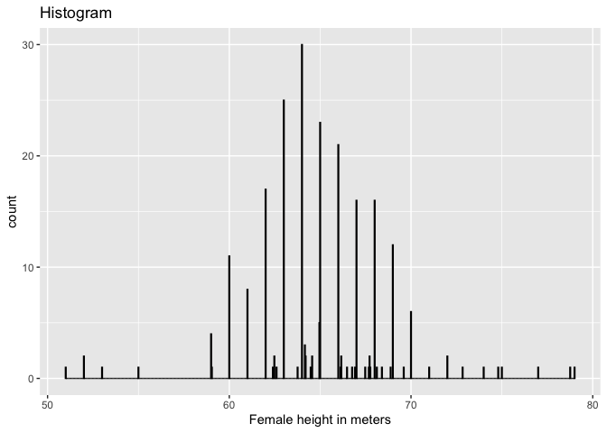<!-- -->

``` r
## Boxplot 
heights %>% 
  ggplot(aes(sex, height)) + geom_boxplot(outlier.shape = NA) + geom_jitter(alpha = 0.5, size = 1)
```

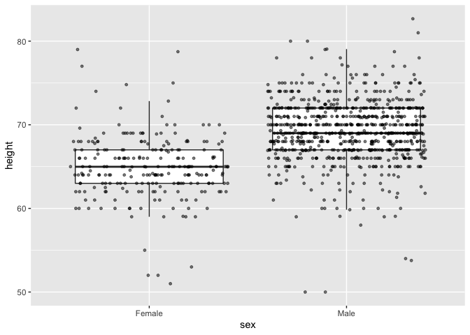<!-- -->

``` r
## QQPlot 

heights %>% 
  ggplot(aes(sample = height)) + geom_qq() + stat_qq() + stat_qq_line()
```

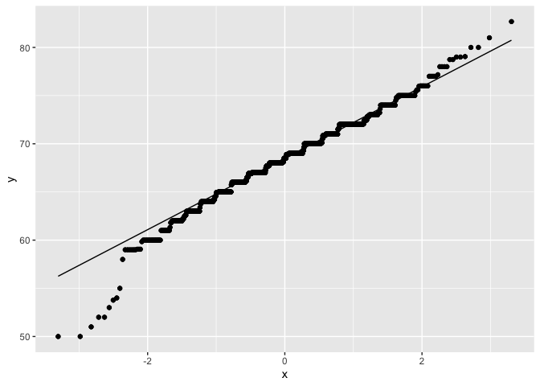<!-- -->

``` r
heights %>% 
  filter(sex=="Male") %>%
  ggplot(aes(sample = scale(height))) + 
  geom_qq() +
  geom_abline()
```

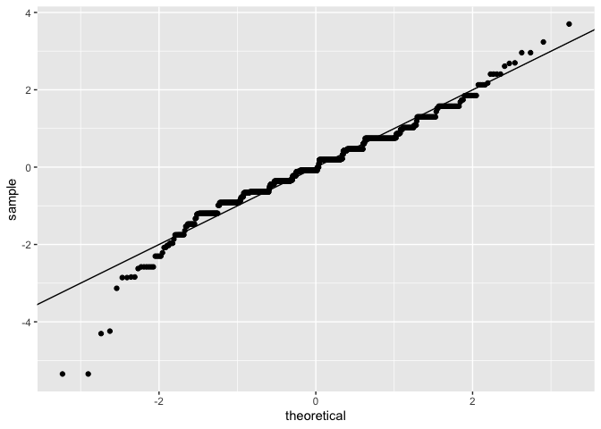<!-- -->

``` r
# Further Examples
# Boxplot, group male female
heights %>% 
  ggplot(aes(sex,height)) + 
  geom_boxplot(outlier.shape = NA) + 
  geom_jitter(alpha = 0.25, width = 0.25)
```

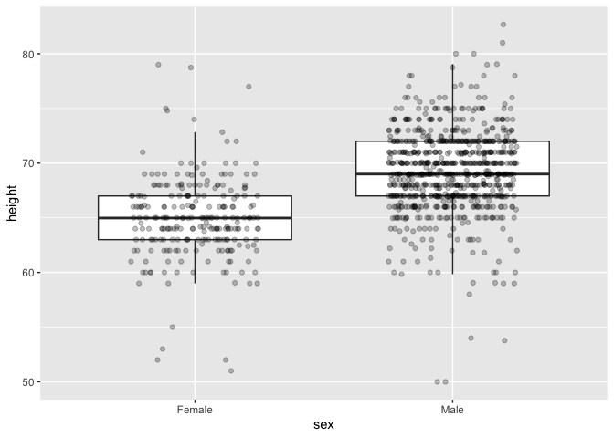<!-- -->

# Gapminder

``` r
library(dslabs)
library(tidyverse)
library(ggthemes)
data(gapminder)

# Bosnia Line Graph Life Expectancy
gapminder %>% 
  filter(country == "Bosnia and Herzegovina") %>% 
  ggplot() + 
  geom_line(aes(year,life_expectancy)) +
  scale_y_continuous(labels = scales::comma) + 
  xlab("Year") + ylab("Life Expectancy") + 
  ggtitle("Line Graph of Bosnia Life Expectancy") + 
  theme_calc()
```

<!-- -->

``` r
# Infant mortality rate by continents
gapminder %>% 
  filter(year == 2014) %>% 
  ggplot() + geom_boxplot(aes(continent, infant_mortality, color = continent), show.legend = F)
```

    ## Warning: Removed 7 rows containing non-finite values (stat_boxplot).

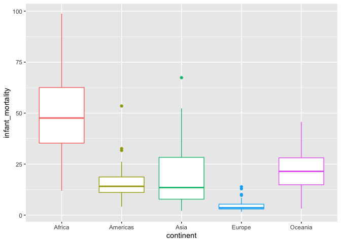<!-- -->

``` r
# What regions are there actually?
levels(gapminder$region)
```

    ##  [1] "Australia and New Zealand" "Caribbean"                
    ##  [3] "Central America"           "Central Asia"             
    ##  [5] "Eastern Africa"            "Eastern Asia"             
    ##  [7] "Eastern Europe"            "Melanesia"                
    ##  [9] "Micronesia"                "Middle Africa"            
    ## [11] "Northern Africa"           "Northern America"         
    ## [13] "Northern Europe"           "Polynesia"                
    ## [15] "South America"             "South-Eastern Asia"       
    ## [17] "Southern Africa"           "Southern Asia"            
    ## [19] "Southern Europe"           "Western Africa"           
    ## [21] "Western Asia"              "Western Europe"

``` r
# Histogram Europe Population
gapminder %>% 
  filter(year == 2015 & region %in% c("Eastern Europe", "Northern Europe", "Southern Europe", "Western Europe")) %>% 
  ggplot() + geom_histogram(aes(population))
```

    ## `stat_bin()` using `bins = 30`. Pick better value with `binwidth`.

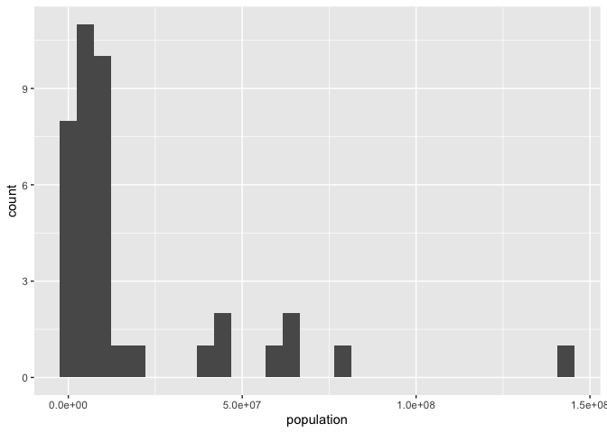<!-- -->

``` r
# Histogram Europe Population
gapminder %>% 
  filter(year == 2015 & continent == "Europe") %>% 
  ggplot() + geom_histogram(aes(population)) + scale_x_continuous(labels = scales::comma)
```

    ## `stat_bin()` using `bins = 30`. Pick better value with `binwidth`.

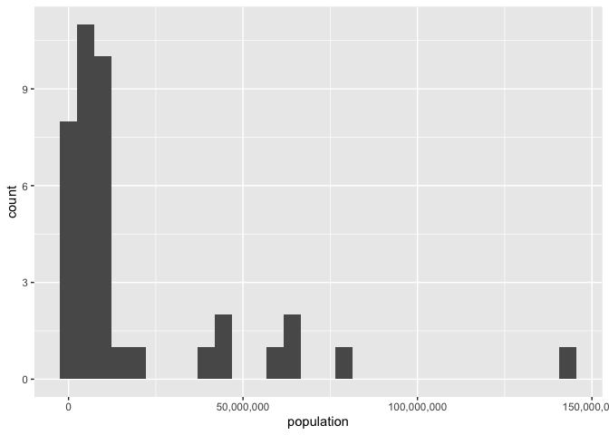<!-- -->

``` r
# Population Bar Graph of Europe
gapminder %>% 
  filter(year == 2015 & continent == "Europe") %>% 
  ggplot(aes(y=reorder(country, population),x = population)) + 
  geom_bar(stat = "identity") + 
  scale_x_continuous(labels = scales::comma) + 
  ggtitle("Bar Graph of European Countries") + 
  xlab("Population") + 
  ylab("Country")
```

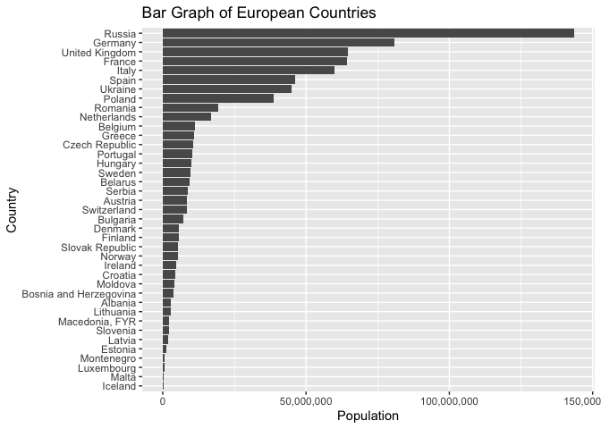<!-- -->

``` r
# Biggest Life Expectancy Countries in Europe?
gapminder %>% 
  filter(year == 2016 & continent == "Europe") %>% 
  slice_max(life_expectancy, n = 5)
```

    ##       country year infant_mortality life_expectancy fertility population gdp
    ## 1     Iceland 2016               NA            83.3        NA         NA  NA
    ## 2 Switzerland 2016               NA            83.1        NA         NA  NA
    ## 3       Spain 2016               NA            82.7        NA         NA  NA
    ## 4       Italy 2016               NA            82.3        NA         NA  NA
    ## 5  Luxembourg 2016               NA            82.3        NA         NA  NA
    ##   continent          region
    ## 1    Europe Northern Europe
    ## 2    Europe  Western Europe
    ## 3    Europe Southern Europe
    ## 4    Europe Southern Europe
    ## 5    Europe  Western Europe

``` r
## Bar Graph
gapminder %>% 
  filter(year == 2016 & continent == "Europe") %>% 
  ggplot(aes(y = reorder(country, life_expectancy), x = life_expectancy)) + 
  geom_bar(stat = "identity") + 
  coord_cartesian(xlim = c(70,85)) + 
  xlab("Life Expectancy") + ylab(NULL) + 
  labs(title = "Life Expectancy in European Countries (2016)", caption = "Gapminder data.")
```

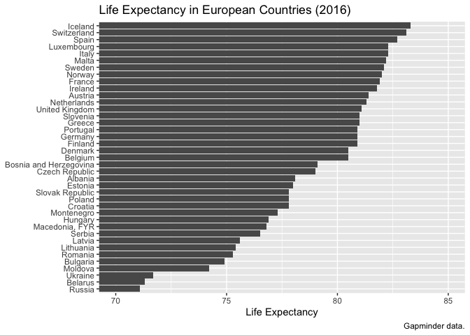<!-- -->

``` r
# Israel in its region
gapminder %>% 
  filter(country %in% c("Israel", "Lebanon", "Egypt", "Saudi Arabia", "Bahrain", "West Bank and Gaza", "Yemen", "United Arab Emirate", "Iran", "Syria")) %>% 
  filter(year == 2009) %>% 
  ggplot(aes(gdp,country)) + geom_bar(stat = "identity")
```

    ## Warning: Removed 1 rows containing missing values (position_stack).

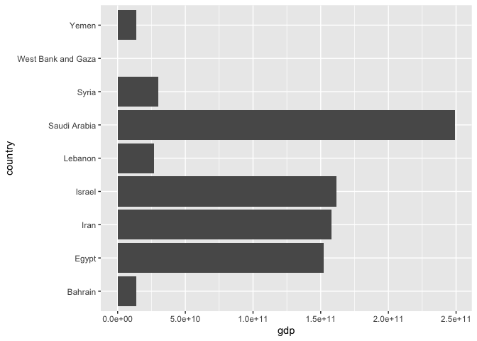<!-- -->

``` r
# Replication of rafalab github book: fertility on life expectancy


# How was fertility and life expectancy in 1962?
gapminder %>% 
  filter(year == 1962) %>% 
  ggplot(aes(fertility, life_expectancy)) + 
  geom_point()
```

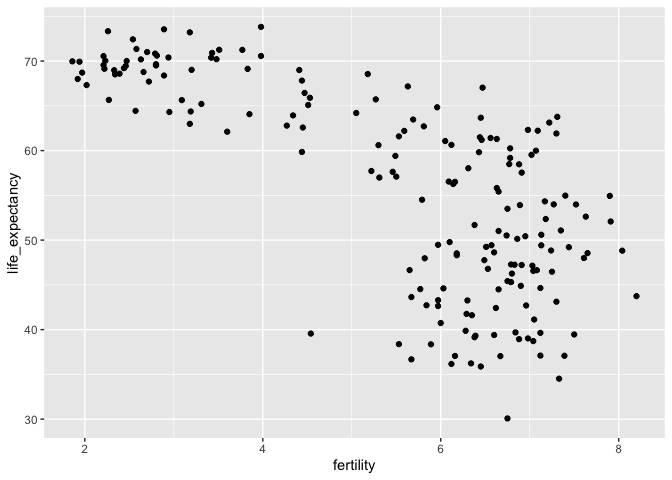<!-- -->

``` r
# How was fertility and life expectancy in 1962 and what are the continents?
gapminder %>% 
  filter(year == 1962) %>% 
  ggplot(aes(fertility, life_expectancy, color = continent)) + 
  geom_point()
```

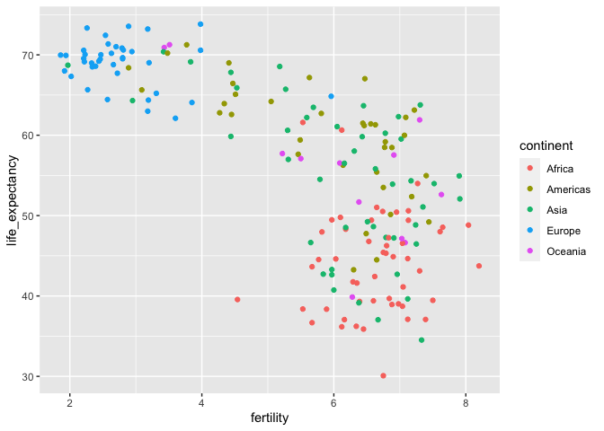<!-- -->

``` r
# How was it in 2012 compared to 1962?
gapminder %>% 
  filter(year %in% c(1962,2012)) %>% 
  ggplot(aes(fertility, life_expectancy, color = continent)) + 
  geom_point() + 
  facet_grid(.~year)
```

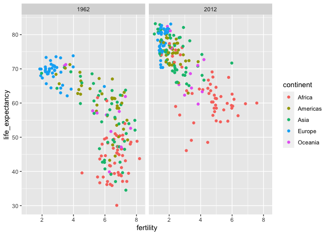<!-- -->

``` r
# Show me the development in detail over time
gapminder %>% 
  filter(year %in% c(1962,1972,1982,1992,2002,2012)) %>% 
  ggplot(aes(fertility, life_expectancy, color = continent)) + 
  geom_point() + 
  facet_wrap(.~year)
```

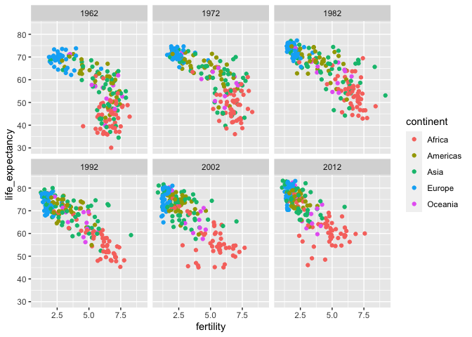<!-- -->

``` r
# fertility distribution in Europe
gapminder %>% 
  filter(continent == "Europe" & year == 2015) %>% 
  ggplot(aes(fertility, fill = region)) + 
  geom_histogram(bins = 20)
```

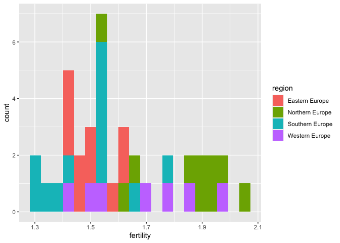<!-- -->

``` r
# fertility distribution in Africa
gapminder %>% 
  filter(continent == "Africa" & year == 2015) %>% 
  ggplot(aes(fertility, fill = region)) + 
  geom_histogram(bins = 20)
```

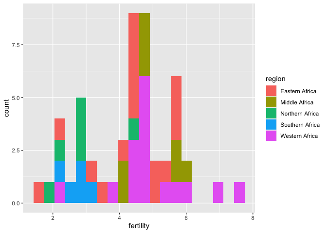<!-- -->

``` r
# Fertility distribution compared in Africa and Europe with ggridges
gapminder %>% 
  filter(year == 2015) %>%  
  ggplot(aes(fertility,continent, fill = continent)) + ggridges::geom_density_ridges(show.legend = F) 
```

    ## Picking joint bandwidth of 0.315

    ## Warning: Removed 1 rows containing non-finite values (stat_density_ridges).

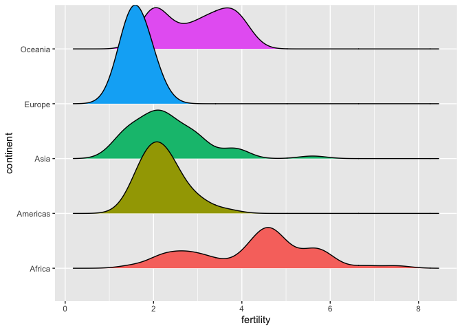<!-- -->

``` r
# Density rigdes on other variable distributions
gapminder %>% 
  filter(year == 2015) %>% # 2015: because latest year with most available data
  ggplot(aes(life_expectancy,continent, fill = continent)) + 
  ggridges::geom_density_ridges(show.legend = F)
```

    ## Picking joint bandwidth of 2.23

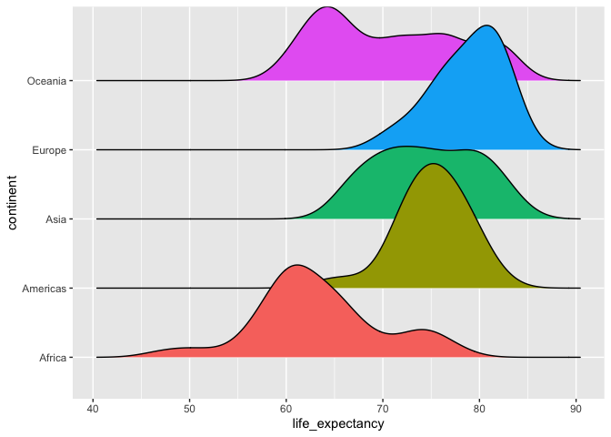<!-- -->

``` r
# child mortality distribution continents 
gapminder %>% 
  filter(year == 2015) %>%  
  ggplot(aes(infant_mortality,continent, fill = continent)) + ggridges::geom_density_ridges(show.legend = F) 
```

    ## Picking joint bandwidth of 4.58

    ## Warning: Removed 7 rows containing non-finite values (stat_density_ridges).

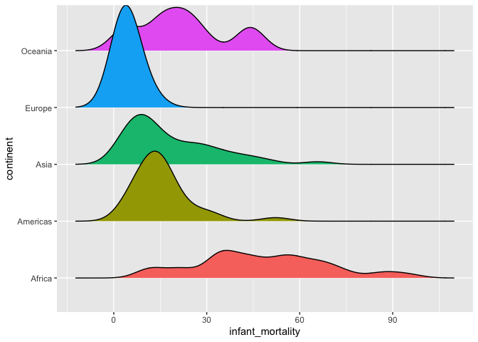<!-- -->

``` r
# population distribution continents 
gapminder %>% 
  filter(year == 2015) %>%  
  ggplot(aes(population,continent, fill = continent)) + 
  ggridges::geom_density_ridges(show.legend = F) +
  scale_x_log10()
```

    ## Picking joint bandwidth of 0.32

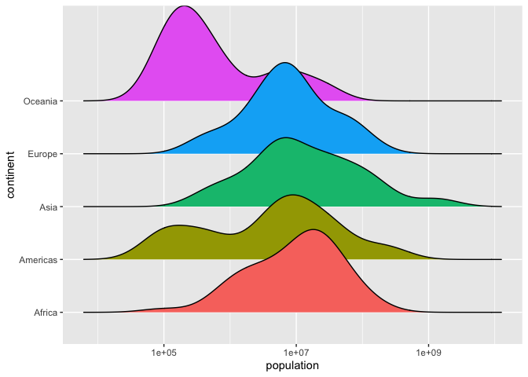<!-- -->

``` r
# -> Hmmmm, not really useful, I think

# gdp densitiy ridges across continents
gapminder %>% 
  filter(year == 2010) %>%  
  ggplot(aes(gdp,continent, fill = continent)) + 
  ggridges::geom_density_ridges(show.legend = F) +
  scale_x_log10()
```

    ## Picking joint bandwidth of 0.383

    ## Warning: Removed 9 rows containing non-finite values (stat_density_ridges).

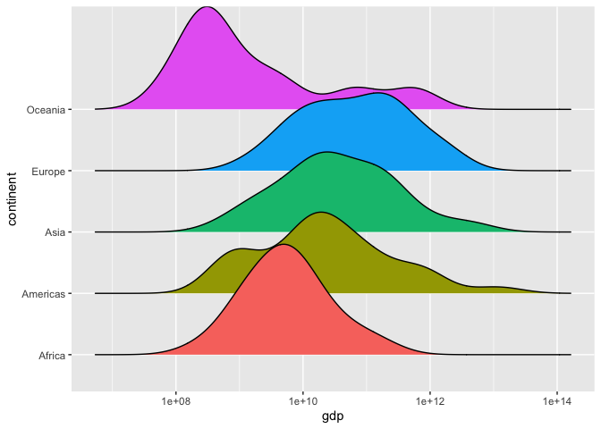<!-- -->

``` r
# Boxplots, group difference, two points in time
# Life expectancy between continents 1962 and 2012
gapminder %>% 
  filter(year %in% c(1962,2012)) %>% 
  mutate(year = factor(year, levels = c(1962,2012))) %>% 
  ggplot(aes(continent,life_expectancy, fill = year)) + 
  geom_boxplot() + 
  xlab("Continent") + ylab("LIfe Expectancy") + 
  labs(title = "Life expectancy between continents in 1962 and 2012")
```

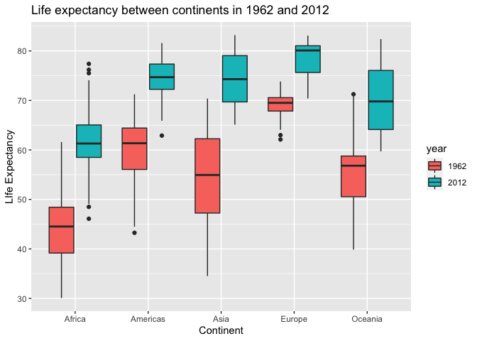<!-- -->
