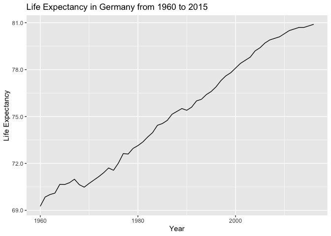
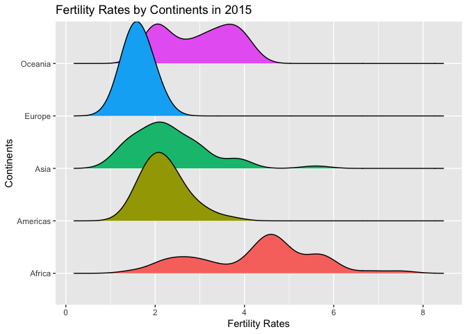
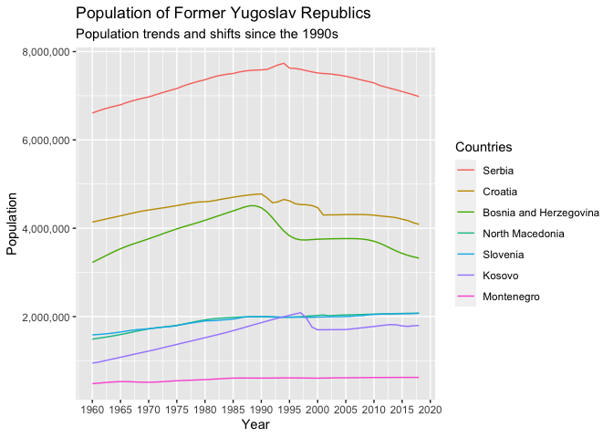

Portfolio: Data Analysis in R
================

Analysis is done with `tidyverse` and `ggplot2`.

# 1. Gapminder Dataset

## Exploration and Analysis

What was the life expectancy in Germany for the last 60 years?

``` r
gapminder %>% 
  filter(country == "Germany") %>% 
  ggplot() + 
  geom_line(aes(year,life_expectancy)) +
  scale_y_continuous(labels = scales::comma) + 
  xlab("Year") + ylab("Life Expectancy") + 
  ggtitle("Life Expectancy in Germany from 1960 to 2015")
```

<!-- -->

What are the differences in infant mortality rates by continent?

``` r
gapminder %>% 
  filter(year == 2014) %>% 
  ggplot() + geom_boxplot(aes(continent, infant_mortality, color = continent), show.legend = F) + 
  ggtitle("Infant Mortality Rates by Continents") + 
  xlab("Continents") + 
  ylab("Infant Mortality Rates")
```

    ## Warning: Removed 7 rows containing non-finite values (stat_boxplot).

<!-- -->

What regions in gapminder are there actually?

``` r
levels(gapminder$region)
```

    ##  [1] "Australia and New Zealand" "Caribbean"                
    ##  [3] "Central America"           "Central Asia"             
    ##  [5] "Eastern Africa"            "Eastern Asia"             
    ##  [7] "Eastern Europe"            "Melanesia"                
    ##  [9] "Micronesia"                "Middle Africa"            
    ## [11] "Northern Africa"           "Northern America"         
    ## [13] "Northern Europe"           "Polynesia"                
    ## [15] "South America"             "South-Eastern Asia"       
    ## [17] "Southern Africa"           "Southern Asia"            
    ## [19] "Southern Europe"           "Western Africa"           
    ## [21] "Western Asia"              "Western Europe"

Population bar graph of Europe by countries.

``` r
gapminder %>% 
  filter(year == 2015 & continent == "Europe") %>% 
  ggplot(aes(y=reorder(country, population),x = population)) + 
  geom_bar(stat = "identity") + 
  scale_x_continuous(labels = scales::comma) + 
  ggtitle("Population of European Countries") + 
  xlab("Population") + 
  ylab("Country")
```

<!-- -->

Pie chart of Europe’s population

``` r
gapminder %>% 
  filter(year == 2015 & continent == "Europe") %>% 
  ggplot(aes(y=reorder(country, population),x = population)) + 
  geom_bar(stat = "identity") + 
  scale_x_continuous(labels = scales::comma) + 
  coord_polar("y", start=0) +
  ggtitle("Population of European Countries") + 
  xlab("Population") + 
  ylab("Country")
```

<!-- -->

What are the countries with the biggest life expectancy in Europe?

``` r
gapminder %>% 
  filter(year == 2016 & continent == "Europe") %>% 
  slice_max(life_expectancy, n = 5)
```

    ##       country year infant_mortality life_expectancy fertility population gdp
    ## 1     Iceland 2016               NA            83.3        NA         NA  NA
    ## 2 Switzerland 2016               NA            83.1        NA         NA  NA
    ## 3       Spain 2016               NA            82.7        NA         NA  NA
    ## 4       Italy 2016               NA            82.3        NA         NA  NA
    ## 5  Luxembourg 2016               NA            82.3        NA         NA  NA
    ##   continent          region
    ## 1    Europe Northern Europe
    ## 2    Europe  Western Europe
    ## 3    Europe Southern Europe
    ## 4    Europe Southern Europe
    ## 5    Europe  Western Europe

Bar graph of life expectancy in Europe by countries.

``` r
gapminder %>% 
  filter(year == 2016 & continent == "Europe") %>% 
  ggplot(aes(y = reorder(country, life_expectancy), x = life_expectancy)) +
  geom_bar(stat = "identity") + 
  coord_cartesian(xlim = c(70,85)) + 
  xlab("Life Expectancy") + ylab(NULL) + 
  labs(title = "Life Expectancy in European Countries (2016)", caption = "Gapminder data.")
```

<!-- -->

The GDP of middle-eastern countries.

``` r
gapminder %>% 
  filter(country %in% c("Israel", "Lebanon", "Egypt", "Saudi Arabia", "Bahrain", "West Bank and Gaza", "Yemen", "United Arab Emirate", "Iran", "Syria")) %>% 
  filter(year == 2009) %>% 
  ggplot(aes(gdp,country)) + 
  geom_bar(stat = "identity") + 
  ggtitle("Bar Graph of GDP in Middle-Eastern Countries") + 
  xlab("GDP") + 
  ylab("Country")
```

    ## Warning: Removed 1 rows containing missing values (position_stack).

<!-- -->

What was the correlation between fertility and life expectancy in 1962?

``` r
gapminder %>% 
  filter(year == 1962) %>% 
  ggplot(aes(fertility, life_expectancy)) + 
  geom_point() + 
  ggtitle("Fertility and Life Expectancy in 1962") + 
  xlab("Fertility") + 
  ylab("Life Expectancy") + 
  theme_clean()
```

<!-- -->

What was the correlation between fertility and life expectancy by
continents in 1962?

``` r
gapminder %>% 
  filter(year == 1962) %>% 
  ggplot(aes(fertility, life_expectancy, color = continent)) + 
  geom_point() + 
  ggtitle("Fertility and Life Expectancy in 1962") + 
  xlab("Fertility") + 
  ylab("Life Expectancy")
```

<!-- -->

How was it in 2012 compared to 1962?

``` r
gapminder %>% 
  filter(year %in% c(1962,2012)) %>% 
  ggplot(aes(fertility, life_expectancy, color = continent)) + 
  geom_point() + 
  facet_grid(.~year) + 
  ggtitle("Fertility and Life Expectancy in 1962 and 2012") + 
  xlab("Fertility") + 
  ylab("Life Expectancy")
```

<!-- -->

Show me its development in detail over time

``` r
gapminder %>% 
  filter(year %in% c(1962,1972,1982,1992,2002,2012)) %>% 
  ggplot(aes(fertility, life_expectancy, color = continent)) + 
  geom_point() + 
  facet_wrap(.~year) + 
  ggtitle("Fertility and Life Expectancy from 1962 to 2012") + 
  xlab("Fertility") + 
  ylab("Life Expectancy")
```

<!-- -->

What is the fertility distribution in Europe like?

``` r
gapminder %>% 
  filter(continent == "Europe" & year == 2015) %>% 
  ggplot(aes(fertility, fill = region)) + 
  geom_boxplot() + 
  coord_flip() +
  ggtitle("Fertility Rates in Europe by Regions in 2015") + 
  xlab("Fertility Rates")
```

<!-- -->

What is the fertility distribution in Asia like?

``` r
gapminder %>% 
  filter(continent == "Asia" & year == 2015) %>% 
  ggplot(aes(fertility, fill = region)) + 
  geom_boxplot() + 
  coord_flip() +
  ggtitle("Fertility Rates in Asia by Regions in 2015") + 
  xlab("Fertility Rates")
```

<!-- -->

What is the fertility distribution like by continents?

``` r
gapminder %>% 
  filter(year == 2015) %>%  
  ggplot(aes(fertility,continent, fill = continent)) + ggridges::geom_density_ridges(show.legend = F) + 
  ggtitle("Fertility Rates by Continents in 2015") + 
  xlab("Fertility Rates") + 
  ylab("Continents")
```

    ## Picking joint bandwidth of 0.315

    ## Warning: Removed 1 rows containing non-finite values (stat_density_ridges).

<!-- -->

Density rigdes on other variable distributions

``` r
gapminder %>% 
  filter(year == 2015) %>% 
  ggplot(aes(life_expectancy,continent, fill = continent)) + 
  ggridges::geom_density_ridges(show.legend = F) + 
  ggtitle("Life Expectancy by Continents in 2015") + 
  xlab("Life Expectancy") + 
  ylab("Continents")
```

    ## Picking joint bandwidth of 2.23

<!-- -->

How has the life expectancy in countries by continents changed between
the years 1962 and 2012?

``` r
gapminder %>% 
  filter(year %in% c(1962,2012)) %>% 
  mutate(year = factor(year, levels = c(1962,2012))) %>% 
  ggplot(aes(continent,life_expectancy, fill = year)) + 
  geom_boxplot() + 
  xlab("Continent") + ylab("Life Expectancy") + 
  labs(title = "Life expectancy between continents in 1962 and 2012")
```

<!-- -->

# 2. European Social Survey Dataset

## Require Data

``` r
library(essurvey)

# Set email. Needed for authentication
set_email("dino.c@me.com")

# # Show which countries are available
show_countries()
```

    ##  [1] "Albania"            "Austria"            "Belgium"           
    ##  [4] "Bulgaria"           "Croatia"            "Cyprus"            
    ##  [7] "Czechia"            "Denmark"            "Estonia"           
    ## [10] "Finland"            "France"             "Germany"           
    ## [13] "Greece"             "Hungary"            "Iceland"           
    ## [16] "Ireland"            "Israel"             "Italy"             
    ## [19] "Kosovo"             "Latvia"             "Lithuania"         
    ## [22] "Luxembourg"         "Montenegro"         "Netherlands"       
    ## [25] "Norway"             "Poland"             "Portugal"          
    ## [28] "Romania"            "Russian Federation" "Serbia"            
    ## [31] "Slovakia"           "Slovenia"           "Spain"             
    ## [34] "Sweden"             "Switzerland"        "Turkey"            
    ## [37] "Ukraine"            "United Kingdom"

``` r
# Download data
ess_9 <- import_rounds(9)
```

    ## Downloading ESS9

    ##   |                                                                              |                                                                      |   0%  |                                                                              |                                                                      |   1%  |                                                                              |=                                                                     |   1%  |                                                                              |=                                                                     |   2%  |                                                                              |==                                                                    |   2%  |                                                                              |==                                                                    |   3%  |                                                                              |==                                                                    |   4%  |                                                                              |===                                                                   |   4%  |                                                                              |===                                                                   |   5%  |                                                                              |====                                                                  |   5%  |                                                                              |====                                                                  |   6%  |                                                                              |=====                                                                 |   7%  |                                                                              |=====                                                                 |   8%  |                                                                              |======                                                                |   8%  |                                                                              |======                                                                |   9%  |                                                                              |=======                                                               |   9%  |                                                                              |=======                                                               |  10%  |                                                                              |=======                                                               |  11%  |                                                                              |========                                                              |  11%  |                                                                              |========                                                              |  12%  |                                                                              |=========                                                             |  12%  |                                                                              |=========                                                             |  13%  |                                                                              |==========                                                            |  14%  |                                                                              |==========                                                            |  15%  |                                                                              |===========                                                           |  15%  |                                                                              |===========                                                           |  16%  |                                                                              |============                                                          |  17%  |                                                                              |============                                                          |  18%  |                                                                              |=============                                                         |  18%  |                                                                              |=============                                                         |  19%  |                                                                              |==============                                                        |  19%  |                                                                              |==============                                                        |  20%  |                                                                              |==============                                                        |  21%  |                                                                              |===============                                                       |  21%  |                                                                              |===============                                                       |  22%  |                                                                              |================                                                      |  22%  |                                                                              |================                                                      |  23%  |                                                                              |=================                                                     |  24%  |                                                                              |=================                                                     |  25%  |                                                                              |==================                                                    |  25%  |                                                                              |==================                                                    |  26%  |                                                                              |===================                                                   |  26%  |                                                                              |===================                                                   |  27%  |                                                                              |===================                                                   |  28%  |                                                                              |====================                                                  |  28%  |                                                                              |====================                                                  |  29%  |                                                                              |=====================                                                 |  29%  |                                                                              |=====================                                                 |  30%  |                                                                              |=====================                                                 |  31%  |                                                                              |======================                                                |  31%  |                                                                              |======================                                                |  32%  |                                                                              |=======================                                               |  32%  |                                                                              |=======================                                               |  33%  |                                                                              |=======================                                               |  34%  |                                                                              |========================                                              |  34%  |                                                                              |========================                                              |  35%  |                                                                              |=========================                                             |  35%  |                                                                              |=========================                                             |  36%  |                                                                              |==========================                                            |  37%  |                                                                              |==========================                                            |  38%  |                                                                              |===========================                                           |  38%  |                                                                              |===========================                                           |  39%  |                                                                              |============================                                          |  39%  |                                                                              |============================                                          |  40%  |                                                                              |============================                                          |  41%  |                                                                              |=============================                                         |  41%  |                                                                              |=============================                                         |  42%  |                                                                              |==============================                                        |  42%  |                                                                              |==============================                                        |  43%  |                                                                              |===============================                                       |  44%  |                                                                              |===============================                                       |  45%  |                                                                              |================================                                      |  45%  |                                                                              |================================                                      |  46%  |                                                                              |=================================                                     |  47%  |                                                                              |=================================                                     |  48%  |                                                                              |==================================                                    |  48%  |                                                                              |==================================                                    |  49%  |                                                                              |===================================                                   |  49%  |                                                                              |===================================                                   |  50%  |                                                                              |===================================                                   |  51%  |                                                                              |====================================                                  |  51%  |                                                                              |====================================                                  |  52%  |                                                                              |=====================================                                 |  52%  |                                                                              |=====================================                                 |  53%  |                                                                              |======================================                                |  54%  |                                                                              |======================================                                |  55%  |                                                                              |=======================================                               |  55%  |                                                                              |=======================================                               |  56%  |                                                                              |========================================                              |  56%  |                                                                              |========================================                              |  57%  |                                                                              |========================================                              |  58%  |                                                                              |=========================================                             |  58%  |                                                                              |=========================================                             |  59%  |                                                                              |==========================================                            |  59%  |                                                                              |==========================================                            |  60%  |                                                                              |==========================================                            |  61%  |                                                                              |===========================================                           |  61%  |                                                                              |===========================================                           |  62%  |                                                                              |============================================                          |  62%  |                                                                              |============================================                          |  63%  |                                                                              |============================================                          |  64%  |                                                                              |=============================================                         |  64%  |                                                                              |=============================================                         |  65%  |                                                                              |==============================================                        |  65%  |                                                                              |==============================================                        |  66%  |                                                                              |===============================================                       |  67%  |                                                                              |===============================================                       |  68%  |                                                                              |================================================                      |  68%  |                                                                              |================================================                      |  69%  |                                                                              |=================================================                     |  69%  |                                                                              |=================================================                     |  70%  |                                                                              |=================================================                     |  71%  |                                                                              |==================================================                    |  71%  |                                                                              |==================================================                    |  72%  |                                                                              |===================================================                   |  72%  |                                                                              |===================================================                   |  73%  |                                                                              |====================================================                  |  74%  |                                                                              |====================================================                  |  75%  |                                                                              |=====================================================                 |  75%  |                                                                              |=====================================================                 |  76%  |                                                                              |======================================================                |  77%  |                                                                              |======================================================                |  78%  |                                                                              |=======================================================               |  78%  |                                                                              |=======================================================               |  79%  |                                                                              |========================================================              |  79%  |                                                                              |========================================================              |  80%  |                                                                              |========================================================              |  81%  |                                                                              |=========================================================             |  81%  |                                                                              |=========================================================             |  82%  |                                                                              |==========================================================            |  82%  |                                                                              |==========================================================            |  83%  |                                                                              |===========================================================           |  84%  |                                                                              |===========================================================           |  85%  |                                                                              |============================================================          |  85%  |                                                                              |============================================================          |  86%  |                                                                              |=============================================================         |  86%  |                                                                              |=============================================================         |  87%  |                                                                              |=============================================================         |  88%  |                                                                              |==============================================================        |  88%  |                                                                              |==============================================================        |  89%  |                                                                              |===============================================================       |  89%  |                                                                              |===============================================================       |  90%  |                                                                              |===============================================================       |  91%  |                                                                              |================================================================      |  91%  |                                                                              |================================================================      |  92%  |                                                                              |=================================================================     |  92%  |                                                                              |=================================================================     |  93%  |                                                                              |=================================================================     |  94%  |                                                                              |==================================================================    |  94%  |                                                                              |==================================================================    |  95%  |                                                                              |===================================================================   |  95%  |                                                                              |===================================================================   |  96%  |                                                                              |====================================================================  |  97%  |                                                                              |====================================================================  |  98%  |                                                                              |===================================================================== |  98%  |                                                                              |===================================================================== |  99%  |                                                                              |======================================================================|  99%  |                                                                              |======================================================================| 100%

    ## Warning: Round 9  was read with the `foreign` package rather than with  the `haven` package for compatibility reasons.
    ##  Please report any issues at https://github.com/ropensci/essurvey/issues

## Exploration and Analysis

Skim to get an overview of the variables.

``` r
# skimr::skim(ess_9)
```

Glimpse to get a peak at the first values.

``` r
# glimpse(ess_9)
head(ess_9)
```

    ## # A tibble: 6 × 572
    ##   name   essround edition proddate   idno cntry nwspol netusoft  netustm ppltrst
    ##   <chr>     <int> <chr>   <chr>     <int> <chr>  <int> <fct>       <int> <fct>  
    ## 1 ESS9e…        9 3.1     17.02.20…    27 AT        60 Every day     180 2      
    ## 2 ESS9e…        9 3.1     17.02.20…   137 AT        10 Every day      20 7      
    ## 3 ESS9e…        9 3.1     17.02.20…   194 AT        60 Most days     180 5      
    ## 4 ESS9e…        9 3.1     17.02.20…   208 AT        45 Every day     120 3      
    ## 5 ESS9e…        9 3.1     17.02.20…   220 AT        30 Never          NA 5      
    ## 6 ESS9e…        9 3.1     17.02.20…   254 AT        45 Only occ…      NA 8      
    ## # … with 562 more variables: pplfair <fct>, pplhlp <fct>, polintr <fct>,
    ## #   psppsgva <fct>, actrolga <fct>, psppipla <fct>, cptppola <fct>,
    ## #   trstprl <fct>, trstlgl <fct>, trstplc <fct>, trstplt <fct>, trstprt <fct>,
    ## #   trstep <fct>, trstun <fct>, vote <fct>, prtvtcat <fct>, prtvtdbe <fct>,
    ## #   prtvtdbg <fct>, prtvtgch <fct>, prtvtbcy <fct>, prtvtecz <fct>,
    ## #   prtvede1 <fct>, prtvede2 <fct>, prtvtddk <fct>, prtvtgee <fct>,
    ## #   prtvtees <fct>, prtvtdfi <fct>, prtvtdfr <fct>, prtvtcgb <fct>, …

## Interesting Variables

-   [wltdffr: Differences in wealth in country, how
    fair](http://nesstar.ess.nsd.uib.no/webview/index.jsp?v=2&submode=variable&study=http%3A%2F%2F129.177.90.83%3A-1%2Fobj%2FfStudy%2FESS9e03.1&gs=undefined&variable=http%3A%2F%2F129.177.90.83%3A80%2Fobj%2FfVariable%2FESS9e03.1_V518&mode=documentation&top=yes)

-   [poltran: Decisions in country politics are
    transparent](http://nesstar.ess.nsd.uib.no/webview/index.jsp?v=2&submode=variable&study=http%3A%2F%2F129.177.90.83%3A-1%2Fobj%2FfStudy%2FESS9e03.1&gs=undefined&variable=http%3A%2F%2F129.177.90.83%3A80%2Fobj%2FfVariable%2FESS9e03.1_V518&mode=documentation&top=yes)

-   [grspfr: Would you say your gross pay is unfairly low, fair, or
    unfairly
    high](http://nesstar.ess.nsd.uib.no/webview/index.jsp?v=2&submode=variable&study=http%3A%2F%2F129.177.90.83%3A-1%2Fobj%2FfStudy%2FESS9e03.1&gs=undefined&variable=http%3A%2F%2F129.177.90.83%3A80%2Fobj%2FfVariable%2FESS9e03.1_V518&mode=documentation&top=yes)

-   [imprich: Important to be rich, have money and expensive
    things](http://nesstar.ess.nsd.uib.no/webview/index.jsp?v=2&submode=variable&study=http%3A%2F%2F129.177.90.83%3A-1%2Fobj%2FfStudy%2FESS9e03.1&gs=undefined&variable=http%3A%2F%2F129.177.90.83%3A80%2Fobj%2FfVariable%2FESS9e03.1_V518&mode=documentation&top=yes)

-   [ipeqopt: Important that people are treated equally and have equal
    opportunities](http://nesstar.ess.nsd.uib.no/webview/index.jsp?v=2&submode=variable&study=http%3A%2F%2F129.177.90.83%3A-1%2Fobj%2FfStudy%2FESS9e03.1&gs=undefined&variable=http%3A%2F%2F129.177.90.83%3A80%2Fobj%2FfVariable%2FESS9e03.1_V518&mode=documentation&top=yes)

-   [ipstrgv: Important that government is strong and ensures
    safety](http://nesstar.ess.nsd.uib.no/webview/index.jsp?v=2&submode=variable&study=http%3A%2F%2F129.177.90.83%3A-1%2Fobj%2FfStudy%2FESS9e03.1&gs=undefined&variable=http%3A%2F%2F129.177.90.83%3A80%2Fobj%2FfVariable%2FESS9e03.1_V518&mode=documentation&top=yes)

How many subjects were questioned per country?

``` r
ess_9 %>% 
  group_by(cntry) %>% 
  count(sort = T) %>% 
  ggplot() + 
  aes(n, reorder(cntry, n), label = n) + 
  geom_bar(stat = "identity", fill = "steelblue") +
  ggtitle("Subjects per Country")
```

<!-- -->

What are the opinions on differences in wealth?

``` r
ess_9 %>% 
  count(wltdffr) %>% 
  ggplot() + 
  aes(n, wltdffr) + 
  geom_bar(stat = "identity") + 
  ggtitle("Differences in wealth in country, how fair") + 
  ylab("Answers")
```

<!-- -->

Here are the results for Germany.

``` r
ess_9 %>% 
  filter(cntry == "DE") %>% 
  count(wltdffr) %>% 
  ggplot() + 
  aes(n, wltdffr) + 
  geom_bar(stat = "identity") + 
  ggtitle("Differences in wealth in Germany, how fair") + 
  ylab("Answers")
```

<!-- -->

What are the options and how many are there?

``` r
ess_9 %>% 
  distinct(wltdffr)
```

    ## # A tibble: 10 × 1
    ##    wltdffr                
    ##    <fct>                  
    ##  1 Large, extremely unfair
    ##  2 Large, somewhat unfair 
    ##  3 Large, slightly unfair 
    ##  4 Large, very unfair     
    ##  5 Small, very unfair     
    ##  6 <NA>                   
    ##  7 Fair                   
    ##  8 Small, slightly unfair 
    ##  9 Small, somewhat unfair 
    ## 10 Small, extremely unfair

``` r
ess_9 %>% 
  count(wltdffr)
```

    ## # A tibble: 10 × 2
    ##    wltdffr                     n
    ##    <fct>                   <int>
    ##  1 Small, extremely unfair  2251
    ##  2 Small, very unfair       3118
    ##  3 Small, somewhat unfair   3558
    ##  4 Small, slightly unfair   2536
    ##  5 Fair                     6386
    ##  6 Large, slightly unfair   3607
    ##  7 Large, somewhat unfair   8111
    ##  8 Large, very unfair       9691
    ##  9 Large, extremely unfair  6890
    ## 10 <NA>                     3371

Recode values to only have four left at the end, too large unfair or
fair and too small unfair and NAs.

``` r
ess_9 = ess_9 %>% 
  mutate(new_wltdffr = fct_collapse(wltdffr, 
             Too_Large = c("Large, extremely unfair", "Large, very unfair", "Large, somewhat unfair","Large, slightly unfair"), 
             Fair = "Fair", 
             Too_Small = c("Small, extremely unfair", "Small, very unfair", "Small, somewhat unfair","Small, slightly unfair"))) %>% 
  mutate(new_wltdffr = factor(new_wltdffr, levels = c("Too_Large", "Fair", "Too_Small")))
```

Create a count and percentage table.

``` r
d = ess_9 %>% 
  group_by(new_wltdffr) %>% 
  summarise(count = n()) %>% 
  mutate(perc = count/sum(count))
```

Plot a bar graph.

``` r
d %>% 
  ggplot(aes(new_wltdffr, perc, label = round(perc, 2), fill = new_wltdffr)) + 
  geom_bar(stat = "identity") + 
  geom_label(aes(fill = NA), fill = "white") + 
  theme(legend.position = "none") + 
  xlab("Differences in Wealth, Opinon") + ylab("Percentage") + 
  ggtitle("Opinion on Differences in Wealth 2018")
```

<!-- -->

# 3. WDI Dataset

## Require Data

``` r
library(WDI)
```

``` r
# Search for topics in datasets
head(WDIsearch("co2"), 10)
```

    ##       indicator       
    ##  [1,] "CC.CO2.EMSE.BF"
    ##  [2,] "CC.CO2.EMSE.BL"
    ##  [3,] "CC.CO2.EMSE.EL"
    ##  [4,] "CC.CO2.EMSE.EN"
    ##  [5,] "CC.CO2.EMSE.FE"
    ##  [6,] "CC.CO2.EMSE.IL"
    ##  [7,] "CC.CO2.EMSE.IP"
    ##  [8,] "CC.CO2.EMSE.LU"
    ##  [9,] "CC.CO2.EMSE.MC"
    ## [10,] "CC.CO2.EMSE.TR"
    ##       name                                                                
    ##  [1,] "CO2 emissions by sector (Mt CO2 eq) - Bunker Fuels"                
    ##  [2,] "CO2 emissions by sector (Mt CO2 eq) - Building"                    
    ##  [3,] "CO2 emissions by sector (Mt CO2 eq) - Total excluding LUCF"        
    ##  [4,] "CO2 emissions by sector (Mt CO2 eq) - Energy"                      
    ##  [5,] "CO2 emissions by sector (Mt CO2 eq) - Fugitive Emissions"          
    ##  [6,] "CO2 emissions by sector (Mt CO2 eq) - Total including LUCF"        
    ##  [7,] "CO2 emissions by sector (Mt CO2 eq) - Industrial Processes"        
    ##  [8,] "CO2 emissions by sector (Mt CO2 eq) - Land-Use Change and Forestry"
    ##  [9,] "CO2 emissions by sector (Mt CO2 eq) - Manufacturing/Construction"  
    ## [10,] "CO2 emissions by sector (Mt CO2 eq) - Transportation"

``` r
WDIsearch('gdp.*capita.*constant')
```

    ##      indicator             
    ## [1,] "6.0.GDPpc_constant"  
    ## [2,] "NY.GDP.PCAP.KD"      
    ## [3,] "NY.GDP.PCAP.KN"      
    ## [4,] "NY.GDP.PCAP.PP.KD"   
    ## [5,] "NY.GDP.PCAP.PP.KD.87"
    ##      name                                                  
    ## [1,] "GDP per capita, PPP (constant 2011 international $) "
    ## [2,] "GDP per capita (constant 2015 US$)"                  
    ## [3,] "GDP per capita (constant LCU)"                       
    ## [4,] "GDP per capita, PPP (constant 2017 international $)" 
    ## [5,] "GDP per capita, PPP (constant 1987 international $)"

``` r
# Download
dat = WDI(
  country = "all", 
  indicator = c(
  population =  "SP.POP.TOTL", 
  gdp = "NY.GDP.MKTP.CD",
  inc_sha_10 = "SI.DST.10TH.10"),
  start = 1960, end = 2018)
```

## Exploration and Analysis

``` r
# Population Developments
summary(dat)
```

    ##     iso2c             country               year        population       
    ##  Length:15694       Length:15694       Min.   :1960   Min.   :2.833e+03  
    ##  Class :character   Class :character   1st Qu.:1974   1st Qu.:9.333e+05  
    ##  Mode  :character   Mode  :character   Median :1989   Median :6.564e+06  
    ##                                        Mean   :1989   Mean   :2.080e+08  
    ##                                        3rd Qu.:2004   3rd Qu.:4.552e+07  
    ##                                        Max.   :2018   Max.   :7.602e+09  
    ##                                                       NA's   :99         
    ##       gdp              inc_sha_10   
    ##  Min.   :8.824e+06   Min.   :18.3   
    ##  1st Qu.:2.250e+09   1st Qu.:24.7   
    ##  Median :1.656e+10   Median :28.2   
    ##  Mean   :1.055e+12   Mean   :30.1   
    ##  3rd Qu.:1.987e+11   3rd Qu.:34.3   
    ##  Max.   :8.627e+13   Max.   :61.5   
    ##  NA's   :3349        NA's   :13973

``` r
n_distinct(dat$country)
```

    ## [1] 266

``` r
distinct(dat, country)
```

    ##                                                  country
    ## 1                                             Arab World
    ## 2                                                  World
    ## 3            East Asia & Pacific (excluding high income)
    ## 4          Europe & Central Asia (excluding high income)
    ## 5                                             South Asia
    ## 6                                                Andorra
    ## 7                                   United Arab Emirates
    ## 8                                            Afghanistan
    ## 9                                    Antigua and Barbuda
    ## 10                                               Albania
    ## 11                                               Armenia
    ## 12                                                Angola
    ## 13                                             Argentina
    ## 14                                        American Samoa
    ## 15                                               Austria
    ## 16                                             Australia
    ## 17                                                 Aruba
    ## 18                                            Azerbaijan
    ## 19                        Central Europe and the Baltics
    ## 20                                Bosnia and Herzegovina
    ## 21                                              Barbados
    ## 22                                            Bangladesh
    ## 23                                               Belgium
    ## 24                                          Burkina Faso
    ## 25                                              Bulgaria
    ## 26                                               Bahrain
    ## 27                                               Burundi
    ## 28                                                 Benin
    ## 29                                               Bermuda
    ## 30                                     Brunei Darussalam
    ## 31                                               Bolivia
    ## 32                                                Brazil
    ## 33                                          Bahamas, The
    ## 34                                                Bhutan
    ## 35                                              Botswana
    ## 36                                               Belarus
    ## 37                                                Belize
    ## 38                                                Canada
    ## 39                                      Congo, Dem. Rep.
    ## 40                              Central African Republic
    ## 41                                           Congo, Rep.
    ## 42                                           Switzerland
    ## 43                                         Cote d'Ivoire
    ## 44                                                 Chile
    ## 45                                              Cameroon
    ## 46                                                 China
    ## 47                                              Colombia
    ## 48                                            Costa Rica
    ## 49                                                  Cuba
    ## 50                                            Cabo Verde
    ## 51                                               Curacao
    ## 52                                                Cyprus
    ## 53                                        Czech Republic
    ## 54                                               Germany
    ## 55                                              Djibouti
    ## 56                                               Denmark
    ## 57                                              Dominica
    ## 58                                    Dominican Republic
    ## 59                                               Algeria
    ## 60                                               Ecuador
    ## 61                                               Estonia
    ## 62                                      Egypt, Arab Rep.
    ## 63                                               Eritrea
    ## 64                                                 Spain
    ## 65                                              Ethiopia
    ## 66                                        European Union
    ## 67              Fragile and conflict affected situations
    ## 68                                               Finland
    ## 69                                                  Fiji
    ## 70                                 Micronesia, Fed. Sts.
    ## 71                                         Faroe Islands
    ## 72                                                France
    ## 73                                                 Gabon
    ## 74                                        United Kingdom
    ## 75                                               Grenada
    ## 76                                               Georgia
    ## 77                                                 Ghana
    ## 78                                             Gibraltar
    ## 79                                             Greenland
    ## 80                                           Gambia, The
    ## 81                                                Guinea
    ## 82                                     Equatorial Guinea
    ## 83                                                Greece
    ## 84                                             Guatemala
    ## 85                                                  Guam
    ## 86                                         Guinea-Bissau
    ## 87                                                Guyana
    ## 88                                  Hong Kong SAR, China
    ## 89                                              Honduras
    ## 90                                               Croatia
    ## 91                                                 Haiti
    ## 92                                               Hungary
    ## 93                                             Indonesia
    ## 94                                               Ireland
    ## 95                                                Israel
    ## 96                                           Isle of Man
    ## 97                                                 India
    ## 98                                                  Iraq
    ## 99                                    Iran, Islamic Rep.
    ## 100                                              Iceland
    ## 101                                                Italy
    ## 102                                      Channel Islands
    ## 103                                              Jamaica
    ## 104                                               Jordan
    ## 105                                                Japan
    ## 106                                                Kenya
    ## 107                                      Kyrgyz Republic
    ## 108                                             Cambodia
    ## 109                                             Kiribati
    ## 110                                              Comoros
    ## 111                                  St. Kitts and Nevis
    ## 112                            Korea, Dem. People's Rep.
    ## 113                                          Korea, Rep.
    ## 114                                               Kuwait
    ## 115                                       Cayman Islands
    ## 116                                           Kazakhstan
    ## 117                                              Lao PDR
    ## 118                                              Lebanon
    ## 119                                            St. Lucia
    ## 120                                        Liechtenstein
    ## 121                                            Sri Lanka
    ## 122                                              Liberia
    ## 123                                              Lesotho
    ## 124                                            Lithuania
    ## 125                                           Luxembourg
    ## 126                                               Latvia
    ## 127                                                Libya
    ## 128                                              Morocco
    ## 129                                               Monaco
    ## 130                                              Moldova
    ## 131                                           Montenegro
    ## 132                             St. Martin (French part)
    ## 133                                           Madagascar
    ## 134                                     Marshall Islands
    ## 135                                      North Macedonia
    ## 136                                                 Mali
    ## 137                                              Myanmar
    ## 138                                             Mongolia
    ## 139                                     Macao SAR, China
    ## 140                             Northern Mariana Islands
    ## 141                                           Mauritania
    ## 142                                                Malta
    ## 143                                            Mauritius
    ## 144                                             Maldives
    ## 145                                               Malawi
    ## 146                                               Mexico
    ## 147                                             Malaysia
    ## 148                                           Mozambique
    ## 149                                              Namibia
    ## 150                                        New Caledonia
    ## 151                                                Niger
    ## 152                                              Nigeria
    ## 153                                            Nicaragua
    ## 154                                          Netherlands
    ## 155                                               Norway
    ## 156                                                Nepal
    ## 157                                                Nauru
    ## 158                                          New Zealand
    ## 159                                         OECD members
    ## 160                                                 Oman
    ## 161                                               Panama
    ## 162                                                 Peru
    ## 163                                     French Polynesia
    ## 164                                     Papua New Guinea
    ## 165                                          Philippines
    ## 166                                             Pakistan
    ## 167                                               Poland
    ## 168                                          Puerto Rico
    ## 169                                   West Bank and Gaza
    ## 170                                             Portugal
    ## 171                                                Palau
    ## 172                                             Paraguay
    ## 173                                                Qatar
    ## 174                                              Romania
    ## 175                                               Serbia
    ## 176                                   Russian Federation
    ## 177                                               Rwanda
    ## 178                                         Small states
    ## 179                          Pacific island small states
    ## 180                               Caribbean small states
    ## 181                                   Other small states
    ## 182                                         Saudi Arabia
    ## 183                                      Solomon Islands
    ## 184                                           Seychelles
    ## 185                                                Sudan
    ## 186                                               Sweden
    ## 187                                            Singapore
    ## 188                                             Slovenia
    ## 189                                      Slovak Republic
    ## 190                                         Sierra Leone
    ## 191                                           San Marino
    ## 192                                              Senegal
    ## 193                                              Somalia
    ## 194                                             Suriname
    ## 195                                          South Sudan
    ## 196                                Sao Tome and Principe
    ## 197                                          El Salvador
    ## 198                            Sint Maarten (Dutch part)
    ## 199                                 Syrian Arab Republic
    ## 200                                             Eswatini
    ## 201 Latin America & the Caribbean (IDA & IBRD countries)
    ## 202    Middle East & North Africa (IDA & IBRD countries)
    ## 203           East Asia & Pacific (IDA & IBRD countries)
    ## 204                              South Asia (IDA & IBRD)
    ## 205            Sub-Saharan Africa (IDA & IBRD countries)
    ## 206         Europe & Central Asia (IDA & IBRD countries)
    ## 207                             Turks and Caicos Islands
    ## 208                                                 Chad
    ## 209                                                 Togo
    ## 210                                             Thailand
    ## 211                                           Tajikistan
    ## 212                                          Timor-Leste
    ## 213                                         Turkmenistan
    ## 214                                              Tunisia
    ## 215                                                Tonga
    ## 216                                               Turkey
    ## 217                                  Trinidad and Tobago
    ## 218                                               Tuvalu
    ## 219                                             Tanzania
    ## 220                                              Ukraine
    ## 221                                               Uganda
    ## 222                                        United States
    ## 223                                              Uruguay
    ## 224                                           Uzbekistan
    ## 225                             Pre-demographic dividend
    ## 226                           Early-demographic dividend
    ## 227                            Late-demographic dividend
    ## 228                            Post-demographic dividend
    ## 229                       St. Vincent and the Grenadines
    ## 230                                        Venezuela, RB
    ## 231                               British Virgin Islands
    ## 232                                Virgin Islands (U.S.)
    ## 233                                              Vietnam
    ## 234                                              Vanuatu
    ## 235                                                Samoa
    ## 236                                            Euro area
    ## 237                                          High income
    ## 238               Heavily indebted poor countries (HIPC)
    ## 239                                            IBRD only
    ## 240                                            IDA total
    ## 241                                            IDA blend
    ## 242                                             IDA only
    ## 243    Latin America & Caribbean (excluding high income)
    ## 244                                               Kosovo
    ## 245         Least developed countries: UN classification
    ## 246                                           Low income
    ## 247                                  Lower middle income
    ## 248                                  Low & middle income
    ## 249                                        Middle income
    ## 250   Middle East & North Africa (excluding high income)
    ## 251                                  Upper middle income
    ## 252                                        North America
    ## 253                                       Not classified
    ## 254                                          Yemen, Rep.
    ## 255                                  East Asia & Pacific
    ## 256                                Europe & Central Asia
    ## 257                                         South Africa
    ## 258           Sub-Saharan Africa (excluding high income)
    ## 259                                   Sub-Saharan Africa
    ## 260                          Africa Eastern and Southern
    ## 261                           Africa Western and Central
    ## 262                            Latin America & Caribbean
    ## 263                                               Zambia
    ## 264                           Middle East & North Africa
    ## 265                                     IDA & IBRD total
    ## 266                                             Zimbabwe

Random countries population.

``` r
dat %>% 
  filter(country %in% c("Germany","France","United States", "Bosnia and Herzegovina","United Kingdom","China")) %>% 
  ggplot(aes(year,population, color = country)) + 
  geom_line() + 
  scale_y_log10(labels = scales::comma) + 
  ylab("Population (log10)") + xlab("Year") + 
  labs(title = "Random Countries Population", color = "Country")
```

<!-- -->

Bosnia’s population development.

``` r
dat %>% 
  filter(country=="Bosnia and Herzegovina") %>% 
  ggplot(aes(year,population)) + geom_bar(stat = "identity") + 
  scale_x_continuous(breaks = seq(1960,2020,5)) + 
  scale_y_continuous(labels = scales::comma) + 
  labs(title = "Population of Bosnia and Hercegovina") + 
  xlab("Year") + ylab("Population")
```

<!-- -->

Balkan population development.

``` r
dat %>% 
  filter(country %in% c("Bosnia and Herzegovina","Croatia","Serbia","Montenegro","Slovenia","North Macedonia","Kosovo")) %>% 
  ggplot(aes(year,population, color = reorder(country, desc(population)))) + 
  geom_line() + 
  scale_x_continuous(breaks = seq(1960,2020,5)) + 
  scale_y_continuous(labels = scales::comma) + 
  labs(title = "Population of Former Yugoslav Republics", subtitle = "Population trends and shifts since the 1990s", col = "Countries") + 
  xlab("Year") + ylab("Population")
```

<!-- -->

Balkan GDP development.

``` r
dat %>% 
  filter(country %in% c("Bosnia and Herzegovina","Croatia","Serbia","Montenegro","Slovenia","North Macedonia","Kosovo")) %>% 
  filter(between(year, 1995, 2020)) %>% 
  ggplot(aes(year,gdp, color = reorder(country, desc(gdp)))) + 
  geom_line() + 
  scale_x_continuous(breaks = seq(1960,2020,2)) + 
  scale_y_continuous(labels = scales::dollar) +
  labs(title = "GDP of Former Yugoslav Republics", subtitle = "Economic trends and shifts since the 1990s" , col = "Countries") +
  xlab("Year") + ylab("GDP current US$")
```

    ## Warning: Removed 18 row(s) containing missing values (geom_path).

<!-- -->

Income share by richest 10% in Germany and the United States.

``` r
dat %>% 
  filter(country %in% c("Germany","United States")) %>% 
  filter(between(year, 1990, 2020)) %>% 
  ggplot(aes(year,inc_sha_10, color = country)) + geom_line()
```

    ## Warning: Removed 4 row(s) containing missing values (geom_path).

<!-- -->
