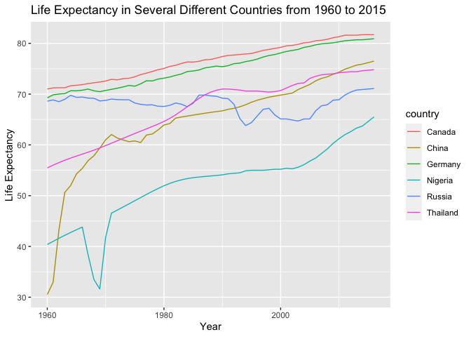
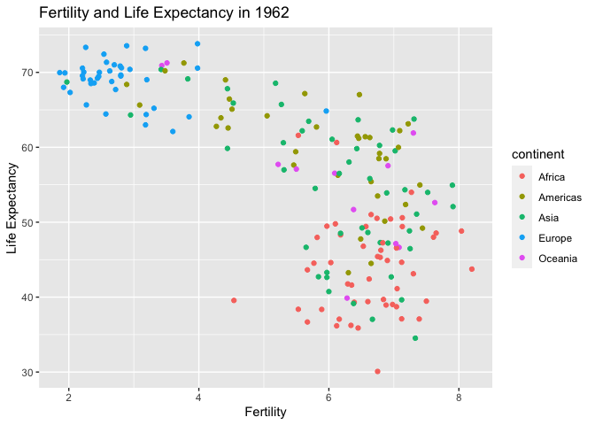
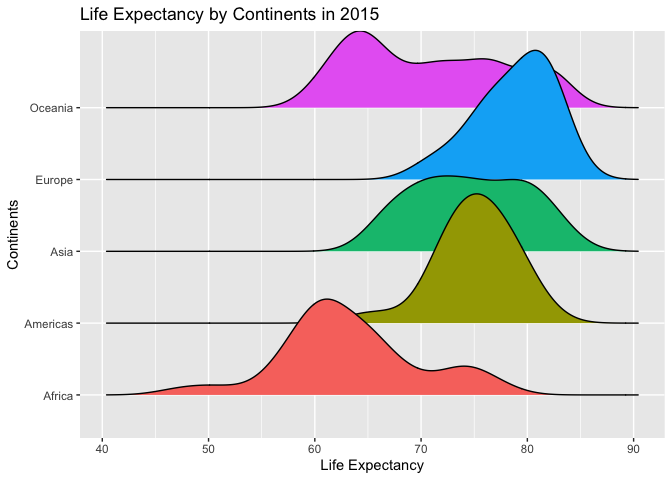
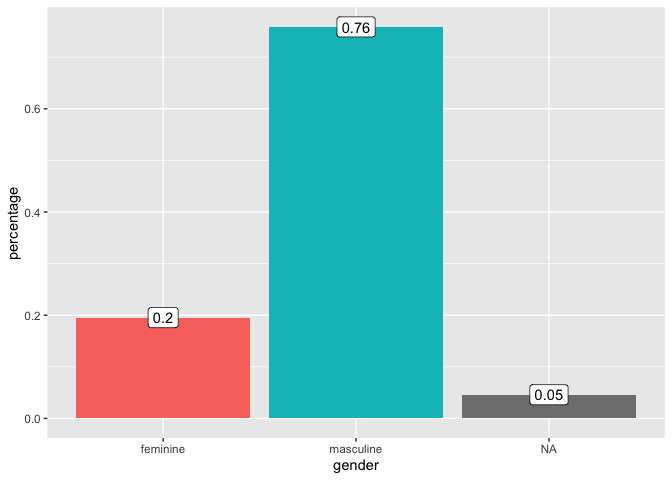
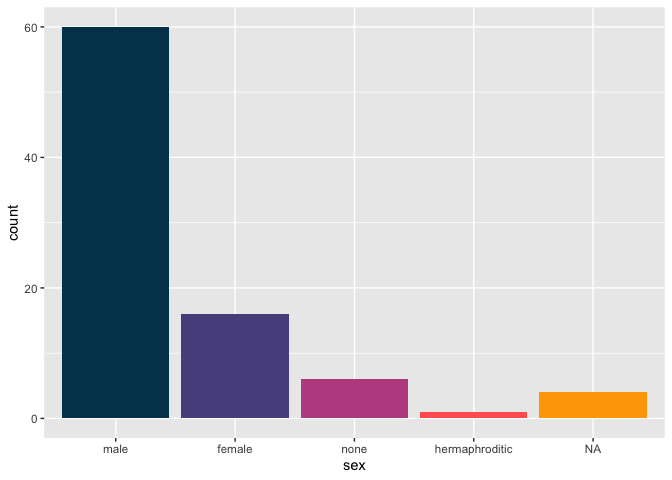

Portfolio: Data Analysis in R
================

Analysis is done with `tidyverse` and `ggplot2`.

# 1. Gapminder Dataset

## Exploration and analysis

What was the life expectancy in Germany for the last 60 years?

``` r
gapminder %>% 
  filter(country == "Germany") %>% 
  ggplot() + 
  geom_line(aes(year,life_expectancy)) +
  scale_y_continuous(labels = scales::comma) + 
  xlab("Year") + ylab("Life Expectancy") + 
  ggtitle("Life Expectancy in Germany from 1960 to 2015")
```

<!-- -->

What are the differences in infant mortality rates by continent?

``` r
gapminder %>% 
  filter(year == 2014) %>% 
  ggplot() + geom_boxplot(aes(continent, infant_mortality, color = continent), show.legend = F) + 
  ggtitle("Infant Mortality Rates by Continents") + 
  xlab("Continents") + 
  ylab("Infant Mortality Rates")
```

    ## Warning: Removed 7 rows containing non-finite values (stat_boxplot).

<!-- -->

What regions in gapminder are there actually?

``` r
levels(gapminder$region)
```

    ##  [1] "Australia and New Zealand" "Caribbean"                
    ##  [3] "Central America"           "Central Asia"             
    ##  [5] "Eastern Africa"            "Eastern Asia"             
    ##  [7] "Eastern Europe"            "Melanesia"                
    ##  [9] "Micronesia"                "Middle Africa"            
    ## [11] "Northern Africa"           "Northern America"         
    ## [13] "Northern Europe"           "Polynesia"                
    ## [15] "South America"             "South-Eastern Asia"       
    ## [17] "Southern Africa"           "Southern Asia"            
    ## [19] "Southern Europe"           "Western Africa"           
    ## [21] "Western Asia"              "Western Europe"

Population bar graph of Europe by countries.

``` r
gapminder %>% 
  filter(year == 2015 & continent == "Europe") %>% 
  ggplot(aes(y=reorder(country, population),x = population)) + 
  geom_bar(stat = "identity") + 
  scale_x_continuous(labels = scales::comma) + 
  ggtitle("Population of European Countries") + 
  xlab("Population") + 
  ylab("Country")
```

<!-- -->

Pie chart of Europe’s population

``` r
gapminder %>% 
  filter(year == 2015 & continent == "Europe") %>% 
  ggplot(aes(y=reorder(country, population),x = population)) + 
  geom_bar(stat = "identity") + 
  scale_x_continuous(labels = scales::comma) + 
  coord_polar("y", start=0) +
  ggtitle("Population of European Countries") + 
  xlab("Population") + 
  ylab("Country")
```

<!-- -->

What are the countries with the biggest life expectancy in Europe?

``` r
gapminder %>% 
  filter(year == 2016 & continent == "Europe") %>% 
  slice_max(life_expectancy, n = 5)
```

    ##       country year infant_mortality life_expectancy fertility population gdp
    ## 1     Iceland 2016               NA            83.3        NA         NA  NA
    ## 2 Switzerland 2016               NA            83.1        NA         NA  NA
    ## 3       Spain 2016               NA            82.7        NA         NA  NA
    ## 4       Italy 2016               NA            82.3        NA         NA  NA
    ## 5  Luxembourg 2016               NA            82.3        NA         NA  NA
    ##   continent          region
    ## 1    Europe Northern Europe
    ## 2    Europe  Western Europe
    ## 3    Europe Southern Europe
    ## 4    Europe Southern Europe
    ## 5    Europe  Western Europe

Bar graph of life expectancy in Europe by countries.

``` r
gapminder %>% 
  filter(year == 2016 & continent == "Europe") %>% 
  ggplot(aes(y = reorder(country, life_expectancy), x = life_expectancy)) +
  geom_bar(stat = "identity") + 
  coord_cartesian(xlim = c(70,85)) + 
  xlab("Life Expectancy") + ylab(NULL) + 
  labs(title = "Life Expectancy in European Countries (2016)", caption = "Gapminder data.")
```

<!-- -->

The GDP of middle-eastern countries.

``` r
gapminder %>% 
  filter(country %in% c("Israel", "Lebanon", "Egypt", "Saudi Arabia", "Bahrain", "West Bank and Gaza", "Yemen", "United Arab Emirate", "Iran", "Syria")) %>% 
  filter(year == 2009) %>% 
  ggplot(aes(gdp,country)) + 
  geom_bar(stat = "identity") + 
  ggtitle("Bar Graph of GDP in Middle-Eastern Countries") + 
  xlab("GDP") + 
  ylab("Country")
```

    ## Warning: Removed 1 rows containing missing values (position_stack).

<!-- -->

What was the correlation between fertility and life expectancy in 1962?

``` r
gapminder %>% 
  filter(year == 1962) %>% 
  ggplot(aes(fertility, life_expectancy)) + 
  geom_point() + 
  ggtitle("Fertility and Life Expectancy in 1962") + 
  xlab("Fertility") + 
  ylab("Life Expectancy") + 
  theme_clean()
```

<!-- -->

What was the correlation between fertility and life expectancy by
continents in 1962?

``` r
gapminder %>% 
  filter(year == 1962) %>% 
  ggplot(aes(fertility, life_expectancy, color = continent)) + 
  geom_point() + 
  ggtitle("Fertility and Life Expectancy in 1962") + 
  xlab("Fertility") + 
  ylab("Life Expectancy")
```

<!-- -->

How was it in 2012 compared to 1962?

``` r
gapminder %>% 
  filter(year %in% c(1962,2012)) %>% 
  ggplot(aes(fertility, life_expectancy, color = continent)) + 
  geom_point() + 
  facet_grid(.~year) + 
  ggtitle("Fertility and Life Expectancy in 1962 and 2012") + 
  xlab("Fertility") + 
  ylab("Life Expectancy")
```

<!-- -->

Show me its development in detail over time

``` r
gapminder %>% 
  filter(year %in% c(1962,1972,1982,1992,2002,2012)) %>% 
  ggplot(aes(fertility, life_expectancy, color = continent)) + 
  geom_point() + 
  facet_wrap(.~year) + 
  ggtitle("Fertility and Life Expectancy from 1962 to 2012") + 
  xlab("Fertility") + 
  ylab("Life Expectancy")
```

<!-- -->

What is the fertility distribution in Europe like?

``` r
gapminder %>% 
  filter(continent == "Europe" & year == 2015) %>% 
  ggplot(aes(fertility, fill = region)) + 
  geom_boxplot() + 
  coord_flip() +
  ggtitle("Fertility Rates in Europe by Regions in 2015") + 
  xlab("Fertility Rates")
```

<!-- -->

What is the fertility distribution in Asia like?

``` r
gapminder %>% 
  filter(continent == "Asia" & year == 2015) %>% 
  ggplot(aes(fertility, fill = region)) + 
  geom_boxplot() + 
  coord_flip() +
  ggtitle("Fertility Rates in Asia by Regions in 2015") + 
  xlab("Fertility Rates")
```

<!-- -->

What is the fertility distribution like by continents?

``` r
gapminder %>% 
  filter(year == 2015) %>%  
  ggplot(aes(fertility,continent, fill = continent)) + ggridges::geom_density_ridges(show.legend = F) + 
  ggtitle("Fertility Rates by Continents in 2015") + 
  xlab("Fertility Rates") + 
  ylab("Continents")
```

    ## Picking joint bandwidth of 0.315

    ## Warning: Removed 1 rows containing non-finite values (stat_density_ridges).

<!-- -->

Density rigdes on other variable distributions

``` r
gapminder %>% 
  filter(year == 2015) %>% 
  ggplot(aes(life_expectancy,continent, fill = continent)) + 
  ggridges::geom_density_ridges(show.legend = F) + 
  ggtitle("Life Expectancy by Continents in 2015") + 
  xlab("Life Expectancy") + 
  ylab("Continents")
```

    ## Picking joint bandwidth of 2.23

<!-- -->

How has the life expectancy in countries by continents changed between
the years 1962 and 2012?

``` r
gapminder %>% 
  filter(year %in% c(1962,2012)) %>% 
  mutate(year = factor(year, levels = c(1962,2012))) %>% 
  ggplot(aes(continent,life_expectancy, fill = year)) + 
  geom_boxplot() + 
  xlab("Continent") + ylab("Life Expectancy") + 
  labs(title = "Life expectancy between continents in 1962 and 2012")
```

<!-- -->

# 2. European Social Survey Dataset

## Require data

``` r
library(essurvey)

# Set email. Needed for authentication
set_email("dino.c@me.com")

# # Show which countries are available
show_countries()
```

    ##  [1] "Albania"            "Austria"            "Belgium"           
    ##  [4] "Bulgaria"           "Croatia"            "Cyprus"            
    ##  [7] "Czechia"            "Denmark"            "Estonia"           
    ## [10] "Finland"            "France"             "Germany"           
    ## [13] "Greece"             "Hungary"            "Iceland"           
    ## [16] "Ireland"            "Israel"             "Italy"             
    ## [19] "Kosovo"             "Latvia"             "Lithuania"         
    ## [22] "Luxembourg"         "Montenegro"         "Netherlands"       
    ## [25] "Norway"             "Poland"             "Portugal"          
    ## [28] "Romania"            "Russian Federation" "Serbia"            
    ## [31] "Slovakia"           "Slovenia"           "Spain"             
    ## [34] "Sweden"             "Switzerland"        "Turkey"            
    ## [37] "Ukraine"            "United Kingdom"

``` r
# Download data
ess_9 <- import_rounds(9)
```

    ## Downloading ESS9

    ##   |                                                                              |                                                                      |   0%  |                                                                              |                                                                      |   1%  |                                                                              |=                                                                     |   1%  |                                                                              |=                                                                     |   2%  |                                                                              |==                                                                    |   2%  |                                                                              |==                                                                    |   3%  |                                                                              |==                                                                    |   4%  |                                                                              |===                                                                   |   4%  |                                                                              |===                                                                   |   5%  |                                                                              |====                                                                  |   5%  |                                                                              |====                                                                  |   6%  |                                                                              |=====                                                                 |   7%  |                                                                              |=====                                                                 |   8%  |                                                                              |======                                                                |   8%  |                                                                              |======                                                                |   9%  |                                                                              |=======                                                               |   9%  |                                                                              |=======                                                               |  10%  |                                                                              |=======                                                               |  11%  |                                                                              |========                                                              |  11%  |                                                                              |========                                                              |  12%  |                                                                              |=========                                                             |  12%  |                                                                              |=========                                                             |  13%  |                                                                              |==========                                                            |  14%  |                                                                              |==========                                                            |  15%  |                                                                              |===========                                                           |  15%  |                                                                              |===========                                                           |  16%  |                                                                              |============                                                          |  17%  |                                                                              |============                                                          |  18%  |                                                                              |=============                                                         |  18%  |                                                                              |=============                                                         |  19%  |                                                                              |==============                                                        |  19%  |                                                                              |==============                                                        |  20%  |                                                                              |==============                                                        |  21%  |                                                                              |===============                                                       |  21%  |                                                                              |===============                                                       |  22%  |                                                                              |================                                                      |  22%  |                                                                              |================                                                      |  23%  |                                                                              |=================                                                     |  24%  |                                                                              |=================                                                     |  25%  |                                                                              |==================                                                    |  25%  |                                                                              |==================                                                    |  26%  |                                                                              |===================                                                   |  26%  |                                                                              |===================                                                   |  27%  |                                                                              |===================                                                   |  28%  |                                                                              |====================                                                  |  28%  |                                                                              |====================                                                  |  29%  |                                                                              |=====================                                                 |  29%  |                                                                              |=====================                                                 |  30%  |                                                                              |=====================                                                 |  31%  |                                                                              |======================                                                |  31%  |                                                                              |======================                                                |  32%  |                                                                              |=======================                                               |  32%  |                                                                              |=======================                                               |  33%  |                                                                              |=======================                                               |  34%  |                                                                              |========================                                              |  34%  |                                                                              |========================                                              |  35%  |                                                                              |=========================                                             |  35%  |                                                                              |=========================                                             |  36%  |                                                                              |==========================                                            |  37%  |                                                                              |==========================                                            |  38%  |                                                                              |===========================                                           |  38%  |                                                                              |===========================                                           |  39%  |                                                                              |============================                                          |  39%  |                                                                              |============================                                          |  40%  |                                                                              |============================                                          |  41%  |                                                                              |=============================                                         |  41%  |                                                                              |=============================                                         |  42%  |                                                                              |==============================                                        |  42%  |                                                                              |==============================                                        |  43%  |                                                                              |===============================                                       |  44%  |                                                                              |===============================                                       |  45%  |                                                                              |================================                                      |  45%  |                                                                              |================================                                      |  46%  |                                                                              |=================================                                     |  47%  |                                                                              |=================================                                     |  48%  |                                                                              |==================================                                    |  48%  |                                                                              |==================================                                    |  49%  |                                                                              |===================================                                   |  49%  |                                                                              |===================================                                   |  50%  |                                                                              |===================================                                   |  51%  |                                                                              |====================================                                  |  51%  |                                                                              |====================================                                  |  52%  |                                                                              |=====================================                                 |  52%  |                                                                              |=====================================                                 |  53%  |                                                                              |======================================                                |  54%  |                                                                              |======================================                                |  55%  |                                                                              |=======================================                               |  55%  |                                                                              |=======================================                               |  56%  |                                                                              |========================================                              |  56%  |                                                                              |========================================                              |  57%  |                                                                              |========================================                              |  58%  |                                                                              |=========================================                             |  58%  |                                                                              |=========================================                             |  59%  |                                                                              |==========================================                            |  59%  |                                                                              |==========================================                            |  60%  |                                                                              |==========================================                            |  61%  |                                                                              |===========================================                           |  61%  |                                                                              |===========================================                           |  62%  |                                                                              |============================================                          |  62%  |                                                                              |============================================                          |  63%  |                                                                              |============================================                          |  64%  |                                                                              |=============================================                         |  64%  |                                                                              |=============================================                         |  65%  |                                                                              |==============================================                        |  65%  |                                                                              |==============================================                        |  66%  |                                                                              |===============================================                       |  67%  |                                                                              |===============================================                       |  68%  |                                                                              |================================================                      |  68%  |                                                                              |================================================                      |  69%  |                                                                              |=================================================                     |  69%  |                                                                              |=================================================                     |  70%  |                                                                              |=================================================                     |  71%  |                                                                              |==================================================                    |  71%  |                                                                              |==================================================                    |  72%  |                                                                              |===================================================                   |  72%  |                                                                              |===================================================                   |  73%  |                                                                              |====================================================                  |  74%  |                                                                              |====================================================                  |  75%  |                                                                              |=====================================================                 |  75%  |                                                                              |=====================================================                 |  76%  |                                                                              |======================================================                |  77%  |                                                                              |======================================================                |  78%  |                                                                              |=======================================================               |  78%  |                                                                              |=======================================================               |  79%  |                                                                              |========================================================              |  79%  |                                                                              |========================================================              |  80%  |                                                                              |========================================================              |  81%  |                                                                              |=========================================================             |  81%  |                                                                              |=========================================================             |  82%  |                                                                              |==========================================================            |  82%  |                                                                              |==========================================================            |  83%  |                                                                              |===========================================================           |  84%  |                                                                              |===========================================================           |  85%  |                                                                              |============================================================          |  85%  |                                                                              |============================================================          |  86%  |                                                                              |=============================================================         |  86%  |                                                                              |=============================================================         |  87%  |                                                                              |=============================================================         |  88%  |                                                                              |==============================================================        |  88%  |                                                                              |==============================================================        |  89%  |                                                                              |===============================================================       |  89%  |                                                                              |===============================================================       |  90%  |                                                                              |===============================================================       |  91%  |                                                                              |================================================================      |  91%  |                                                                              |================================================================      |  92%  |                                                                              |=================================================================     |  92%  |                                                                              |=================================================================     |  93%  |                                                                              |=================================================================     |  94%  |                                                                              |==================================================================    |  94%  |                                                                              |==================================================================    |  95%  |                                                                              |===================================================================   |  95%  |                                                                              |===================================================================   |  96%  |                                                                              |====================================================================  |  97%  |                                                                              |====================================================================  |  98%  |                                                                              |===================================================================== |  98%  |                                                                              |===================================================================== |  99%  |                                                                              |======================================================================|  99%  |                                                                              |======================================================================| 100%

    ## Warning: Round 9  was read with the `foreign` package rather than with  the `haven` package for compatibility reasons.
    ##  Please report any issues at https://github.com/ropensci/essurvey/issues

## Exploration and analysis

Skim to get an overview of the variables.

``` r
# skimr::skim(ess_9)
```

Glimpse to get a peak at the first values.

``` r
# glimpse(ess_9)
head(ess_9)
```

    ## # A tibble: 6 × 572
    ##   name   essround edition proddate   idno cntry nwspol netusoft  netustm ppltrst
    ##   <chr>     <int> <chr>   <chr>     <int> <chr>  <int> <fct>       <int> <fct>  
    ## 1 ESS9e…        9 3.1     17.02.20…    27 AT        60 Every day     180 2      
    ## 2 ESS9e…        9 3.1     17.02.20…   137 AT        10 Every day      20 7      
    ## 3 ESS9e…        9 3.1     17.02.20…   194 AT        60 Most days     180 5      
    ## 4 ESS9e…        9 3.1     17.02.20…   208 AT        45 Every day     120 3      
    ## 5 ESS9e…        9 3.1     17.02.20…   220 AT        30 Never          NA 5      
    ## 6 ESS9e…        9 3.1     17.02.20…   254 AT        45 Only occ…      NA 8      
    ## # … with 562 more variables: pplfair <fct>, pplhlp <fct>, polintr <fct>,
    ## #   psppsgva <fct>, actrolga <fct>, psppipla <fct>, cptppola <fct>,
    ## #   trstprl <fct>, trstlgl <fct>, trstplc <fct>, trstplt <fct>, trstprt <fct>,
    ## #   trstep <fct>, trstun <fct>, vote <fct>, prtvtcat <fct>, prtvtdbe <fct>,
    ## #   prtvtdbg <fct>, prtvtgch <fct>, prtvtbcy <fct>, prtvtecz <fct>,
    ## #   prtvede1 <fct>, prtvede2 <fct>, prtvtddk <fct>, prtvtgee <fct>,
    ## #   prtvtees <fct>, prtvtdfi <fct>, prtvtdfr <fct>, prtvtcgb <fct>, …

## Interesting variables

-   [wltdffr: Differences in wealth in country, how
    fair](http://nesstar.ess.nsd.uib.no/webview/index.jsp?v=2&submode=variable&study=http%3A%2F%2F129.177.90.83%3A-1%2Fobj%2FfStudy%2FESS9e03.1&gs=undefined&variable=http%3A%2F%2F129.177.90.83%3A80%2Fobj%2FfVariable%2FESS9e03.1_V518&mode=documentation&top=yes)

-   [poltran: Decisions in country politics are
    transparent](http://nesstar.ess.nsd.uib.no/webview/index.jsp?v=2&submode=variable&study=http%3A%2F%2F129.177.90.83%3A-1%2Fobj%2FfStudy%2FESS9e03.1&gs=undefined&variable=http%3A%2F%2F129.177.90.83%3A80%2Fobj%2FfVariable%2FESS9e03.1_V518&mode=documentation&top=yes)

-   [grspfr: Would you say your gross pay is unfairly low, fair, or
    unfairly
    high](http://nesstar.ess.nsd.uib.no/webview/index.jsp?v=2&submode=variable&study=http%3A%2F%2F129.177.90.83%3A-1%2Fobj%2FfStudy%2FESS9e03.1&gs=undefined&variable=http%3A%2F%2F129.177.90.83%3A80%2Fobj%2FfVariable%2FESS9e03.1_V518&mode=documentation&top=yes)

-   [imprich: Important to be rich, have money and expensive
    things](http://nesstar.ess.nsd.uib.no/webview/index.jsp?v=2&submode=variable&study=http%3A%2F%2F129.177.90.83%3A-1%2Fobj%2FfStudy%2FESS9e03.1&gs=undefined&variable=http%3A%2F%2F129.177.90.83%3A80%2Fobj%2FfVariable%2FESS9e03.1_V518&mode=documentation&top=yes)

-   [ipeqopt: Important that people are treated equally and have equal
    opportunities](http://nesstar.ess.nsd.uib.no/webview/index.jsp?v=2&submode=variable&study=http%3A%2F%2F129.177.90.83%3A-1%2Fobj%2FfStudy%2FESS9e03.1&gs=undefined&variable=http%3A%2F%2F129.177.90.83%3A80%2Fobj%2FfVariable%2FESS9e03.1_V518&mode=documentation&top=yes)

-   [ipstrgv: Important that government is strong and ensures
    safety](http://nesstar.ess.nsd.uib.no/webview/index.jsp?v=2&submode=variable&study=http%3A%2F%2F129.177.90.83%3A-1%2Fobj%2FfStudy%2FESS9e03.1&gs=undefined&variable=http%3A%2F%2F129.177.90.83%3A80%2Fobj%2FfVariable%2FESS9e03.1_V518&mode=documentation&top=yes)

How many subjects were questioned per country?

``` r
ess_9 %>% 
  group_by(cntry) %>% 
  count(sort = T) %>% 
  ggplot() + 
  aes(n, reorder(cntry, n), label = n) + 
  geom_bar(stat = "identity", fill = "steelblue") +
  ggtitle("Subjects per Country")
```

<!-- -->

What are the opinions on differences in wealth?

``` r
ess_9 %>% 
  count(wltdffr) %>% 
  ggplot() + 
  aes(n, wltdffr) + 
  geom_bar(stat = "identity") + 
  ggtitle("Differences in wealth in country, how fair") + 
  ylab("Answers")
```

<!-- -->

Here are the results for Germany.

``` r
ess_9 %>% 
  filter(cntry == "DE") %>% 
  count(wltdffr) %>% 
  ggplot() + 
  aes(n, wltdffr) + 
  geom_bar(stat = "identity") + 
  ggtitle("Differences in wealth in Germany, how fair") + 
  ylab("Answers")
```

<!-- -->

What are the options and how many are there?

``` r
ess_9 %>% 
  distinct(wltdffr)
```

    ## # A tibble: 10 × 1
    ##    wltdffr                
    ##    <fct>                  
    ##  1 Large, extremely unfair
    ##  2 Large, somewhat unfair 
    ##  3 Large, slightly unfair 
    ##  4 Large, very unfair     
    ##  5 Small, very unfair     
    ##  6 <NA>                   
    ##  7 Fair                   
    ##  8 Small, slightly unfair 
    ##  9 Small, somewhat unfair 
    ## 10 Small, extremely unfair

``` r
ess_9 %>% 
  count(wltdffr)
```

    ## # A tibble: 10 × 2
    ##    wltdffr                     n
    ##    <fct>                   <int>
    ##  1 Small, extremely unfair  2251
    ##  2 Small, very unfair       3118
    ##  3 Small, somewhat unfair   3558
    ##  4 Small, slightly unfair   2536
    ##  5 Fair                     6386
    ##  6 Large, slightly unfair   3607
    ##  7 Large, somewhat unfair   8111
    ##  8 Large, very unfair       9691
    ##  9 Large, extremely unfair  6890
    ## 10 <NA>                     3371

Recode values to only have four left at the end, too large unfair or
fair and too small unfair and NAs.

``` r
ess_9 = ess_9 %>% 
  mutate(new_wltdffr = fct_collapse(wltdffr, 
             Too_Large = c("Large, extremely unfair", "Large, very unfair", "Large, somewhat unfair","Large, slightly unfair"), 
             Fair = "Fair", 
             Too_Small = c("Small, extremely unfair", "Small, very unfair", "Small, somewhat unfair","Small, slightly unfair"))) %>% 
  mutate(new_wltdffr = factor(new_wltdffr, levels = c("Too_Large", "Fair", "Too_Small")))
```

Create a count and percentage table.

``` r
d = ess_9 %>% 
  group_by(new_wltdffr) %>% 
  summarise(count = n()) %>% 
  mutate(perc = count/sum(count))
```

Plot a bar graph.

``` r
d %>% 
  ggplot(aes(new_wltdffr, perc, label = round(perc, 2), fill = new_wltdffr)) + 
  geom_bar(stat = "identity") + 
  geom_label(aes(fill = NA), fill = "white") + 
  theme(legend.position = "none") + 
  xlab("Differences in Wealth, Opinon") + ylab("Percentage") + 
  ggtitle("Opinion on Differences in Wealth 2018")
```

<!-- -->

# 3. WDI Dataset

## Require data

``` r
library(WDI)
```

Search for topics in datasets.

``` r
head(WDIsearch("co2"), 10)
```

    ##       indicator       
    ##  [1,] "CC.CO2.EMSE.BF"
    ##  [2,] "CC.CO2.EMSE.BL"
    ##  [3,] "CC.CO2.EMSE.EL"
    ##  [4,] "CC.CO2.EMSE.EN"
    ##  [5,] "CC.CO2.EMSE.FE"
    ##  [6,] "CC.CO2.EMSE.IL"
    ##  [7,] "CC.CO2.EMSE.IP"
    ##  [8,] "CC.CO2.EMSE.LU"
    ##  [9,] "CC.CO2.EMSE.MC"
    ## [10,] "CC.CO2.EMSE.TR"
    ##       name                                                                
    ##  [1,] "CO2 emissions by sector (Mt CO2 eq) - Bunker Fuels"                
    ##  [2,] "CO2 emissions by sector (Mt CO2 eq) - Building"                    
    ##  [3,] "CO2 emissions by sector (Mt CO2 eq) - Total excluding LUCF"        
    ##  [4,] "CO2 emissions by sector (Mt CO2 eq) - Energy"                      
    ##  [5,] "CO2 emissions by sector (Mt CO2 eq) - Fugitive Emissions"          
    ##  [6,] "CO2 emissions by sector (Mt CO2 eq) - Total including LUCF"        
    ##  [7,] "CO2 emissions by sector (Mt CO2 eq) - Industrial Processes"        
    ##  [8,] "CO2 emissions by sector (Mt CO2 eq) - Land-Use Change and Forestry"
    ##  [9,] "CO2 emissions by sector (Mt CO2 eq) - Manufacturing/Construction"  
    ## [10,] "CO2 emissions by sector (Mt CO2 eq) - Transportation"

``` r
WDIsearch('gdp.*capita.*constant')
```

    ##      indicator             
    ## [1,] "6.0.GDPpc_constant"  
    ## [2,] "NY.GDP.PCAP.KD"      
    ## [3,] "NY.GDP.PCAP.KN"      
    ## [4,] "NY.GDP.PCAP.PP.KD"   
    ## [5,] "NY.GDP.PCAP.PP.KD.87"
    ##      name                                                  
    ## [1,] "GDP per capita, PPP (constant 2011 international $) "
    ## [2,] "GDP per capita (constant 2015 US$)"                  
    ## [3,] "GDP per capita (constant LCU)"                       
    ## [4,] "GDP per capita, PPP (constant 2017 international $)" 
    ## [5,] "GDP per capita, PPP (constant 1987 international $)"

``` r
# Download
dat = WDI(
  country = "all", 
  indicator = c(
  population =  "SP.POP.TOTL", 
  gdp = "NY.GDP.MKTP.CD",
  inc_sha_10 = "SI.DST.10TH.10"),
  start = 1960, end = 2018)
```

## Exploration and analysis

What was the population development like in these specific countries?

``` r
dat %>% 
  filter(country %in% c("Germany","France","United States", "Bosnia and Herzegovina","United Kingdom","China")) %>% 
  ggplot(aes(year,population, color = country)) + 
  geom_line() + 
  scale_y_log10(labels = scales::comma) + 
  ylab("Population (log10)") + xlab("Year") + 
  labs(title = "Random Countries Population", color = "Country")
```

<!-- -->

What was the population development like in the former Yugoslav
Republics?

``` r
dat %>% 
  filter(country %in% c("Bosnia and Herzegovina","Croatia","Serbia","Montenegro","Slovenia","North Macedonia","Kosovo")) %>% 
  ggplot(aes(year,population, color = reorder(country, desc(population)))) + 
  geom_line() + 
  scale_x_continuous(breaks = seq(1960,2020,5)) + 
  scale_y_continuous(labels = scales::comma) + 
  labs(title = "Population of Former Yugoslav Republics", subtitle = "Population trends and shifts since the 1990s", col = "Countries") + 
  xlab("Year") + ylab("Population")
```

<!-- -->

What was the development of GDP in the former Yugoslav Republics?

``` r
dat %>% 
  filter(country %in% c("Bosnia and Herzegovina","Croatia","Serbia","Montenegro","Slovenia","North Macedonia","Kosovo")) %>% 
  filter(between(year, 1995, 2020)) %>% 
  ggplot(aes(year,gdp, color = reorder(country, desc(gdp)))) + 
  geom_line() + 
  scale_x_continuous(breaks = seq(1960,2020,2)) + 
  scale_y_continuous(labels = scales::dollar) +
  labs(title = "GDP of Former Yugoslav Republics", subtitle = "Economic trends and shifts since the 1990s" , col = "Countries") +
  xlab("Year") + ylab("GDP current US$")
```

    ## Warning: Removed 18 row(s) containing missing values (geom_path).

<!-- -->

# Frequent Data Analysis Problems + Solutions

## First exploration of new dataset

The `skim()`shows how many missing and unique values each variable has.
It uses appropriate measures to describe each variable based on its
type: character, numeric or list.

``` r
skimr::skim(starwars)
```

<table style="width: auto;" class="table table-condensed">
<caption>
Data summary
</caption>
<thead>
<tr>
<th style="text-align:left;">
</th>
<th style="text-align:left;">
</th>
</tr>
</thead>
<tbody>
<tr>
<td style="text-align:left;">
Name
</td>
<td style="text-align:left;">
starwars
</td>
</tr>
<tr>
<td style="text-align:left;">
Number of rows
</td>
<td style="text-align:left;">
87
</td>
</tr>
<tr>
<td style="text-align:left;">
Number of columns
</td>
<td style="text-align:left;">
14
</td>
</tr>
<tr>
<td style="text-align:left;">
\_\_\_\_\_\_\_\_\_\_\_\_\_\_\_\_\_\_\_\_\_\_\_
</td>
<td style="text-align:left;">
</td>
</tr>
<tr>
<td style="text-align:left;">
Column type frequency:
</td>
<td style="text-align:left;">
</td>
</tr>
<tr>
<td style="text-align:left;">
character
</td>
<td style="text-align:left;">
8
</td>
</tr>
<tr>
<td style="text-align:left;">
list
</td>
<td style="text-align:left;">
3
</td>
</tr>
<tr>
<td style="text-align:left;">
numeric
</td>
<td style="text-align:left;">
3
</td>
</tr>
<tr>
<td style="text-align:left;">
\_\_\_\_\_\_\_\_\_\_\_\_\_\_\_\_\_\_\_\_\_\_\_\_
</td>
<td style="text-align:left;">
</td>
</tr>
<tr>
<td style="text-align:left;">
Group variables
</td>
<td style="text-align:left;">
None
</td>
</tr>
</tbody>
</table>

**Variable type: character**

<table>
<thead>
<tr>
<th style="text-align:left;">
skim_variable
</th>
<th style="text-align:right;">
n_missing
</th>
<th style="text-align:right;">
complete_rate
</th>
<th style="text-align:right;">
min
</th>
<th style="text-align:right;">
max
</th>
<th style="text-align:right;">
empty
</th>
<th style="text-align:right;">
n_unique
</th>
<th style="text-align:right;">
whitespace
</th>
</tr>
</thead>
<tbody>
<tr>
<td style="text-align:left;">
name
</td>
<td style="text-align:right;">
0
</td>
<td style="text-align:right;">
1.00
</td>
<td style="text-align:right;">
3
</td>
<td style="text-align:right;">
21
</td>
<td style="text-align:right;">
0
</td>
<td style="text-align:right;">
87
</td>
<td style="text-align:right;">
0
</td>
</tr>
<tr>
<td style="text-align:left;">
hair_color
</td>
<td style="text-align:right;">
5
</td>
<td style="text-align:right;">
0.94
</td>
<td style="text-align:right;">
4
</td>
<td style="text-align:right;">
13
</td>
<td style="text-align:right;">
0
</td>
<td style="text-align:right;">
12
</td>
<td style="text-align:right;">
0
</td>
</tr>
<tr>
<td style="text-align:left;">
skin_color
</td>
<td style="text-align:right;">
0
</td>
<td style="text-align:right;">
1.00
</td>
<td style="text-align:right;">
3
</td>
<td style="text-align:right;">
19
</td>
<td style="text-align:right;">
0
</td>
<td style="text-align:right;">
31
</td>
<td style="text-align:right;">
0
</td>
</tr>
<tr>
<td style="text-align:left;">
eye_color
</td>
<td style="text-align:right;">
0
</td>
<td style="text-align:right;">
1.00
</td>
<td style="text-align:right;">
3
</td>
<td style="text-align:right;">
13
</td>
<td style="text-align:right;">
0
</td>
<td style="text-align:right;">
15
</td>
<td style="text-align:right;">
0
</td>
</tr>
<tr>
<td style="text-align:left;">
sex
</td>
<td style="text-align:right;">
4
</td>
<td style="text-align:right;">
0.95
</td>
<td style="text-align:right;">
4
</td>
<td style="text-align:right;">
14
</td>
<td style="text-align:right;">
0
</td>
<td style="text-align:right;">
4
</td>
<td style="text-align:right;">
0
</td>
</tr>
<tr>
<td style="text-align:left;">
gender
</td>
<td style="text-align:right;">
4
</td>
<td style="text-align:right;">
0.95
</td>
<td style="text-align:right;">
8
</td>
<td style="text-align:right;">
9
</td>
<td style="text-align:right;">
0
</td>
<td style="text-align:right;">
2
</td>
<td style="text-align:right;">
0
</td>
</tr>
<tr>
<td style="text-align:left;">
homeworld
</td>
<td style="text-align:right;">
10
</td>
<td style="text-align:right;">
0.89
</td>
<td style="text-align:right;">
4
</td>
<td style="text-align:right;">
14
</td>
<td style="text-align:right;">
0
</td>
<td style="text-align:right;">
48
</td>
<td style="text-align:right;">
0
</td>
</tr>
<tr>
<td style="text-align:left;">
species
</td>
<td style="text-align:right;">
4
</td>
<td style="text-align:right;">
0.95
</td>
<td style="text-align:right;">
3
</td>
<td style="text-align:right;">
14
</td>
<td style="text-align:right;">
0
</td>
<td style="text-align:right;">
37
</td>
<td style="text-align:right;">
0
</td>
</tr>
</tbody>
</table>

**Variable type: list**

<table>
<thead>
<tr>
<th style="text-align:left;">
skim_variable
</th>
<th style="text-align:right;">
n_missing
</th>
<th style="text-align:right;">
complete_rate
</th>
<th style="text-align:right;">
n_unique
</th>
<th style="text-align:right;">
min_length
</th>
<th style="text-align:right;">
max_length
</th>
</tr>
</thead>
<tbody>
<tr>
<td style="text-align:left;">
films
</td>
<td style="text-align:right;">
0
</td>
<td style="text-align:right;">
1
</td>
<td style="text-align:right;">
24
</td>
<td style="text-align:right;">
1
</td>
<td style="text-align:right;">
7
</td>
</tr>
<tr>
<td style="text-align:left;">
vehicles
</td>
<td style="text-align:right;">
0
</td>
<td style="text-align:right;">
1
</td>
<td style="text-align:right;">
11
</td>
<td style="text-align:right;">
0
</td>
<td style="text-align:right;">
2
</td>
</tr>
<tr>
<td style="text-align:left;">
starships
</td>
<td style="text-align:right;">
0
</td>
<td style="text-align:right;">
1
</td>
<td style="text-align:right;">
17
</td>
<td style="text-align:right;">
0
</td>
<td style="text-align:right;">
5
</td>
</tr>
</tbody>
</table>

**Variable type: numeric**

<table>
<thead>
<tr>
<th style="text-align:left;">
skim_variable
</th>
<th style="text-align:right;">
n_missing
</th>
<th style="text-align:right;">
complete_rate
</th>
<th style="text-align:right;">
mean
</th>
<th style="text-align:right;">
sd
</th>
<th style="text-align:right;">
p0
</th>
<th style="text-align:right;">
p25
</th>
<th style="text-align:right;">
p50
</th>
<th style="text-align:right;">
p75
</th>
<th style="text-align:right;">
p100
</th>
<th style="text-align:left;">
hist
</th>
</tr>
</thead>
<tbody>
<tr>
<td style="text-align:left;">
height
</td>
<td style="text-align:right;">
6
</td>
<td style="text-align:right;">
0.93
</td>
<td style="text-align:right;">
174.36
</td>
<td style="text-align:right;">
34.77
</td>
<td style="text-align:right;">
66
</td>
<td style="text-align:right;">
167.0
</td>
<td style="text-align:right;">
180
</td>
<td style="text-align:right;">
191.0
</td>
<td style="text-align:right;">
264
</td>
<td style="text-align:left;">
▁▁▇▅▁
</td>
</tr>
<tr>
<td style="text-align:left;">
mass
</td>
<td style="text-align:right;">
28
</td>
<td style="text-align:right;">
0.68
</td>
<td style="text-align:right;">
97.31
</td>
<td style="text-align:right;">
169.46
</td>
<td style="text-align:right;">
15
</td>
<td style="text-align:right;">
55.6
</td>
<td style="text-align:right;">
79
</td>
<td style="text-align:right;">
84.5
</td>
<td style="text-align:right;">
1358
</td>
<td style="text-align:left;">
▇▁▁▁▁
</td>
</tr>
<tr>
<td style="text-align:left;">
birth_year
</td>
<td style="text-align:right;">
44
</td>
<td style="text-align:right;">
0.49
</td>
<td style="text-align:right;">
87.57
</td>
<td style="text-align:right;">
154.69
</td>
<td style="text-align:right;">
8
</td>
<td style="text-align:right;">
35.0
</td>
<td style="text-align:right;">
52
</td>
<td style="text-align:right;">
72.0
</td>
<td style="text-align:right;">
896
</td>
<td style="text-align:left;">
▇▁▁▁▁
</td>
</tr>
</tbody>
</table>

The glimpse function, on the other hand, gives us a good peak at the
first raw values each variable has.

``` r
glimpse(starwars)
```

    ## Rows: 87
    ## Columns: 14
    ## $ name       <chr> "Luke Skywalker", "C-3PO", "R2-D2", "Darth Vader", "Leia Or…
    ## $ height     <int> 172, 167, 96, 202, 150, 178, 165, 97, 183, 182, 188, 180, 2…
    ## $ mass       <dbl> 77.0, 75.0, 32.0, 136.0, 49.0, 120.0, 75.0, 32.0, 84.0, 77.…
    ## $ hair_color <chr> "blond", NA, NA, "none", "brown", "brown, grey", "brown", N…
    ## $ skin_color <chr> "fair", "gold", "white, blue", "white", "light", "light", "…
    ## $ eye_color  <chr> "blue", "yellow", "red", "yellow", "brown", "blue", "blue",…
    ## $ birth_year <dbl> 19.0, 112.0, 33.0, 41.9, 19.0, 52.0, 47.0, NA, 24.0, 57.0, …
    ## $ sex        <chr> "male", "none", "none", "male", "female", "male", "female",…
    ## $ gender     <chr> "masculine", "masculine", "masculine", "masculine", "femini…
    ## $ homeworld  <chr> "Tatooine", "Tatooine", "Naboo", "Tatooine", "Alderaan", "T…
    ## $ species    <chr> "Human", "Droid", "Droid", "Human", "Human", "Human", "Huma…
    ## $ films      <list> <"The Empire Strikes Back", "Revenge of the Sith", "Return…
    ## $ vehicles   <list> <"Snowspeeder", "Imperial Speeder Bike">, <>, <>, <>, "Imp…
    ## $ starships  <list> <"X-wing", "Imperial shuttle">, <>, <>, "TIE Advanced x1",…

## A Count and prop table

**First way with `forcats::fct_count()`** Calculates a count and prop
table.

``` r
starwars$sex %>%
 factor() %>% 
  fct_count(sort = T, prop = T)
```

    ## # A tibble: 5 × 3
    ##   f                  n      p
    ##   <fct>          <int>  <dbl>
    ## 1 male              60 0.690 
    ## 2 female            16 0.184 
    ## 3 none               6 0.0690
    ## 4 <NA>               4 0.0460
    ## 5 hermaphroditic     1 0.0115

**Second way with `deplyr::count()`** Simply mutate a frequency and
percentage column on a counted table.

``` r
starwars %>% 
 count(sex) %>% 
  mutate(freq = n / sum(n)) %>% 
  mutate(perc = freq * 100)
```

    ## # A tibble: 5 × 4
    ##   sex                n   freq  perc
    ##   <chr>          <int>  <dbl> <dbl>
    ## 1 female            16 0.184  18.4 
    ## 2 hermaphroditic     1 0.0115  1.15
    ## 3 male              60 0.690  69.0 
    ## 4 none               6 0.0690  6.90
    ## 5 <NA>               4 0.0460  4.60

## Bar graph with count data

Here is a situation where we calculated a count table for hair color -
we summarized all values. If we then want to plot a bar graph based on
that count table we run into problems, because ggplot2 is expecting a
non-summarized or normal data frame.

``` r
hair_color_table = starwars %>% 
  mutate(hair_color = fct_lump_min(hair_color, 2)) %>% 
  group_by(hair_color) %>% 
  summarise(n = n())
hair_color_table
```

    ## # A tibble: 7 × 2
    ##   hair_color     n
    ##   <fct>      <int>
    ## 1 black         13
    ## 2 blond          3
    ## 3 brown         18
    ## 4 none          37
    ## 5 white          4
    ## 6 Other          7
    ## 7 <NA>           5

To tell the function that we have already summarized data, we add the
argument `stat = "identity"` to the `geom_bar()` function.

``` r
hair_color_table %>% 
  ggplot(aes(x = reorder(hair_color, n), y = n, fill = hair_color)) + 
  geom_bar(stat = "identity") + 
  theme(legend.position = "none")
```

<!-- -->

## Bar graph with percentage labels

First we create a table with counts and percentages:

``` r
d = starwars %>% 
  group_by(gender) %>% 
  summarise(count = n()) %>% 
  mutate(percentage = count/sum(count))
d
```

    ## # A tibble: 3 × 3
    ##   gender    count percentage
    ##   <chr>     <int>      <dbl>
    ## 1 feminine     17     0.195 
    ## 2 masculine    66     0.759 
    ## 3 <NA>          4     0.0460

Then we plot a graph with bar and with percentage labels.

``` r
d %>% 
  ggplot(aes(gender, percentage, label = round(percentage, 2), fill = gender)) + 
  geom_bar(stat = "identity") + 
  geom_label(aes(fill = NA), fill = "white") + 
  theme(legend.position = "none")
```

<!-- -->

## Collapse factors to „Other”

This syntax mutates the categorical variable homeworld into eight of its
most frequent values. The other values are being collapsed into the
categorical value „other”.

``` r
starwars %>% 
  mutate(homeworld = fct_lump_n(homeworld, n = 8)) %>% 
  group_by(homeworld) %>% 
  summarise(mean(height, na.rm =T), mean(mass, na.rm = T), n())
```

    ## # A tibble: 11 × 4
    ##    homeworld `mean(height, na.rm = T)` `mean(mass, na.rm = T)` `n()`
    ##    <fct>                         <dbl>                   <dbl> <int>
    ##  1 Alderaan                       176.                    64       3
    ##  2 Corellia                       175                     78.5     2
    ##  3 Coruscant                      174.                    50       3
    ##  4 Kamino                         208.                    83.1     3
    ##  5 Kashyyyk                       231                    124       2
    ##  6 Mirial                         168                     53.1     2
    ##  7 Naboo                          175.                    64.2    11
    ##  8 Ryloth                         179                     55       2
    ##  9 Tatooine                       170.                    85.4    10
    ## 10 Other                          173.                   117.     39
    ## 11 <NA>                           139.                    82      10

## Filter for specific values

We can easily filter out cases with certain column values, like for
example the states of Hawai and Alaska. We use `filter()`, the operator
`!` and `%in%`.

``` r
starwars %>% 
  filter(!homeworld%in%c("Tatooine","Naboo")) %>% 
  select(name, homeworld)
```

    ## # A tibble: 66 × 2
    ##    name                  homeworld 
    ##    <chr>                 <chr>     
    ##  1 Leia Organa           Alderaan  
    ##  2 Obi-Wan Kenobi        Stewjon   
    ##  3 Wilhuff Tarkin        Eriadu    
    ##  4 Chewbacca             Kashyyyk  
    ##  5 Han Solo              Corellia  
    ##  6 Greedo                Rodia     
    ##  7 Jabba Desilijic Tiure Nal Hutta 
    ##  8 Wedge Antilles        Corellia  
    ##  9 Jek Tono Porkins      Bestine IV
    ## 10 Yoda                  <NA>      
    ## # … with 56 more rows

## Change bar colors in barplot

You can manually pick the colors with `fill` and a vector containing the
color values. Either in String, written out.

``` r
starwars %>% 
  mutate(sex = fct_infreq(sex)) %>% 
  ggplot(aes(sex)) + 
  geom_bar(fill = c("red","blue","green","black","grey")) 
```

<!-- -->

Or with RGB Color Codes.

``` r
starwars %>% 
    mutate(sex = fct_infreq(sex)) %>%
    ggplot(aes(sex)) +
    geom_bar(fill = c("#003f5c","#58508d","#bc5090","#ff6361","#ffa600")) 
```

<!-- -->

## Hide aes(color) mapping legend

Here is an example where we want the bar colored based on the variable
itself, but without the mapping legend.

``` r
starwars %>% 
  mutate(sex = fct_infreq(sex)) %>% 
  ggplot(aes(sex, fill = sex)) + 
  geom_bar()
```

<!-- -->

Hide the geom_bar legend.

``` r
starwars %>% 
  mutate(sex = fct_infreq(sex)) %>% 
  ggplot(aes(sex, fill = sex)) + 
  geom_bar(show.legend = F)
```

<!-- -->

Remove just the legend title:

``` r
starwars %>% 
  mutate(sex = fct_infreq(sex)) %>% 
  ggplot(aes(sex, fill = sex)) + 
  geom_bar() +
  theme(legend.title = element_blank())
```

<!-- -->

Hide all legends created:

``` r
starwars %>% 
  mutate(sex = fct_infreq(sex)) %>% 
  ggplot(aes(sex, fill = sex)) + 
  geom_bar() +
  theme(legend.position = "none")
```

<!-- -->

## Re-code values of categorical variables

**First way** We can use `fct_collapse()`to create a new column with the
new recoded values in it.

**Second way** By using `mutate`, to create a new column with our own
values and `case_when`, to run through our observations looking for
defined cases, together with “variable” `%in%`, we can create our own
groups.

``` r
gapminder %>% 
 mutate(group = case_when(
    region %in% c("Western Europe", "Northern Europe","Southern Europe","Northern America", "Australia and New Zealand") ~ "West", # If region is one of values -> assign it "West" in new group column.
    region %in% c("Eastern Asia", "South-Eastern Asia") ~ "East Asia",
    region %in% c("Caribbean", "Central America", "South America") ~ "Latin America",
    continent == "Africa" & 
      region != "Northern Africa" ~ "Sub-Saharan",
    TRUE ~ "Others")) %>%  # If nothing above applies -> assign it "Others" in group column
  head(10)
```

    ##                country year infant_mortality life_expectancy fertility
    ## 1              Albania 1960           115.40           62.87      6.19
    ## 2              Algeria 1960           148.20           47.50      7.65
    ## 3               Angola 1960           208.00           35.98      7.32
    ## 4  Antigua and Barbuda 1960               NA           62.97      4.43
    ## 5            Argentina 1960            59.87           65.39      3.11
    ## 6              Armenia 1960               NA           66.86      4.55
    ## 7                Aruba 1960               NA           65.66      4.82
    ## 8            Australia 1960            20.30           70.87      3.45
    ## 9              Austria 1960            37.30           68.75      2.70
    ## 10          Azerbaijan 1960               NA           61.33      5.57
    ##    population          gdp continent                    region         group
    ## 1     1636054           NA    Europe           Southern Europe          West
    ## 2    11124892  13828152297    Africa           Northern Africa        Others
    ## 3     5270844           NA    Africa             Middle Africa   Sub-Saharan
    ## 4       54681           NA  Americas                 Caribbean Latin America
    ## 5    20619075 108322326649  Americas             South America Latin America
    ## 6     1867396           NA      Asia              Western Asia        Others
    ## 7       54208           NA  Americas                 Caribbean Latin America
    ## 8    10292328  96677859364   Oceania Australia and New Zealand          West
    ## 9     7065525  52392699681    Europe            Western Europe          West
    ## 10    3897889           NA      Asia              Western Asia        Others

We turn this `group` variable into a factor to control the order of the
levels:

## Order color legend

Order color legend by a variable’s values.

## Show unique values

Display all unique values of variable.

``` r
distinct(starwars, species) # dplyr function
```

    ## # A tibble: 38 × 1
    ##    species       
    ##    <chr>         
    ##  1 Human         
    ##  2 Droid         
    ##  3 Wookiee       
    ##  4 Rodian        
    ##  5 Hutt          
    ##  6 Yoda's species
    ##  7 Trandoshan    
    ##  8 Mon Calamari  
    ##  9 Ewok          
    ## 10 Sullustan     
    ## # … with 28 more rows

**Note**: `distinct(dat$countries)` doesn’t work.

## Slice rows by maximum or minimum values

**Note:** parameter `n` must be explicitly written, otherwise it throws
an error.

``` r
starwars %>% 
  slice_max(height, n = 5)
```

    ## # A tibble: 5 × 14
    ##   name     height  mass hair_color skin_color eye_color birth_year sex   gender 
    ##   <chr>     <int> <dbl> <chr>      <chr>      <chr>          <dbl> <chr> <chr>  
    ## 1 Yarael …    264    NA none       white      yellow            NA male  mascul…
    ## 2 Tarfful     234   136 brown      brown      blue              NA male  mascul…
    ## 3 Lama Su     229    88 none       grey       black             NA male  mascul…
    ## 4 Chewbac…    228   112 brown      unknown    blue             200 male  mascul…
    ## 5 Roos Ta…    224    82 none       grey       orange            NA male  mascul…
    ## # … with 5 more variables: homeworld <chr>, species <chr>, films <list>,
    ## #   vehicles <list>, starships <list>

Show me 5% of the lowest height rows.

``` r
starwars %>% 
  slice_min(height, prop = 0.05)
```

    ## # A tibble: 4 × 14
    ##   name      height  mass hair_color skin_color eye_color birth_year sex   gender
    ##   <chr>      <int> <dbl> <chr>      <chr>      <chr>          <dbl> <chr> <chr> 
    ## 1 Yoda          66    17 white      green      brown            896 male  mascu…
    ## 2 Ratts Ty…     79    15 none       grey, blue unknown           NA male  mascu…
    ## 3 Wicket S…     88    20 brown      brown      brown              8 male  mascu…
    ## 4 Dud Bolt      94    45 none       blue, grey yellow            NA male  mascu…
    ## # … with 5 more variables: homeworld <chr>, species <chr>, films <list>,
    ## #   vehicles <list>, starships <list>

## Show Number of `NA`s

For a quick check of how many missing values there are in a single
column:

``` r
sum(is.na(starwars$height))
```

    ## [1] 6

And how many are not `NA`s.

``` r
sum(!is.na(starwars$height))
```

    ## [1] 81

For a more detailed overview of the whole dataset use `skim()`. It shows
a very useful `complete_rate` which tells us how much of the column is
disturbed by missing values.

``` r
skimr::skim(starwars)
```

<table style="width: auto;" class="table table-condensed">
<caption>
Data summary
</caption>
<thead>
<tr>
<th style="text-align:left;">
</th>
<th style="text-align:left;">
</th>
</tr>
</thead>
<tbody>
<tr>
<td style="text-align:left;">
Name
</td>
<td style="text-align:left;">
starwars
</td>
</tr>
<tr>
<td style="text-align:left;">
Number of rows
</td>
<td style="text-align:left;">
87
</td>
</tr>
<tr>
<td style="text-align:left;">
Number of columns
</td>
<td style="text-align:left;">
14
</td>
</tr>
<tr>
<td style="text-align:left;">
\_\_\_\_\_\_\_\_\_\_\_\_\_\_\_\_\_\_\_\_\_\_\_
</td>
<td style="text-align:left;">
</td>
</tr>
<tr>
<td style="text-align:left;">
Column type frequency:
</td>
<td style="text-align:left;">
</td>
</tr>
<tr>
<td style="text-align:left;">
character
</td>
<td style="text-align:left;">
8
</td>
</tr>
<tr>
<td style="text-align:left;">
list
</td>
<td style="text-align:left;">
3
</td>
</tr>
<tr>
<td style="text-align:left;">
numeric
</td>
<td style="text-align:left;">
3
</td>
</tr>
<tr>
<td style="text-align:left;">
\_\_\_\_\_\_\_\_\_\_\_\_\_\_\_\_\_\_\_\_\_\_\_\_
</td>
<td style="text-align:left;">
</td>
</tr>
<tr>
<td style="text-align:left;">
Group variables
</td>
<td style="text-align:left;">
None
</td>
</tr>
</tbody>
</table>

**Variable type: character**

<table>
<thead>
<tr>
<th style="text-align:left;">
skim_variable
</th>
<th style="text-align:right;">
n_missing
</th>
<th style="text-align:right;">
complete_rate
</th>
<th style="text-align:right;">
min
</th>
<th style="text-align:right;">
max
</th>
<th style="text-align:right;">
empty
</th>
<th style="text-align:right;">
n_unique
</th>
<th style="text-align:right;">
whitespace
</th>
</tr>
</thead>
<tbody>
<tr>
<td style="text-align:left;">
name
</td>
<td style="text-align:right;">
0
</td>
<td style="text-align:right;">
1.00
</td>
<td style="text-align:right;">
3
</td>
<td style="text-align:right;">
21
</td>
<td style="text-align:right;">
0
</td>
<td style="text-align:right;">
87
</td>
<td style="text-align:right;">
0
</td>
</tr>
<tr>
<td style="text-align:left;">
hair_color
</td>
<td style="text-align:right;">
5
</td>
<td style="text-align:right;">
0.94
</td>
<td style="text-align:right;">
4
</td>
<td style="text-align:right;">
13
</td>
<td style="text-align:right;">
0
</td>
<td style="text-align:right;">
12
</td>
<td style="text-align:right;">
0
</td>
</tr>
<tr>
<td style="text-align:left;">
skin_color
</td>
<td style="text-align:right;">
0
</td>
<td style="text-align:right;">
1.00
</td>
<td style="text-align:right;">
3
</td>
<td style="text-align:right;">
19
</td>
<td style="text-align:right;">
0
</td>
<td style="text-align:right;">
31
</td>
<td style="text-align:right;">
0
</td>
</tr>
<tr>
<td style="text-align:left;">
eye_color
</td>
<td style="text-align:right;">
0
</td>
<td style="text-align:right;">
1.00
</td>
<td style="text-align:right;">
3
</td>
<td style="text-align:right;">
13
</td>
<td style="text-align:right;">
0
</td>
<td style="text-align:right;">
15
</td>
<td style="text-align:right;">
0
</td>
</tr>
<tr>
<td style="text-align:left;">
sex
</td>
<td style="text-align:right;">
4
</td>
<td style="text-align:right;">
0.95
</td>
<td style="text-align:right;">
4
</td>
<td style="text-align:right;">
14
</td>
<td style="text-align:right;">
0
</td>
<td style="text-align:right;">
4
</td>
<td style="text-align:right;">
0
</td>
</tr>
<tr>
<td style="text-align:left;">
gender
</td>
<td style="text-align:right;">
4
</td>
<td style="text-align:right;">
0.95
</td>
<td style="text-align:right;">
8
</td>
<td style="text-align:right;">
9
</td>
<td style="text-align:right;">
0
</td>
<td style="text-align:right;">
2
</td>
<td style="text-align:right;">
0
</td>
</tr>
<tr>
<td style="text-align:left;">
homeworld
</td>
<td style="text-align:right;">
10
</td>
<td style="text-align:right;">
0.89
</td>
<td style="text-align:right;">
4
</td>
<td style="text-align:right;">
14
</td>
<td style="text-align:right;">
0
</td>
<td style="text-align:right;">
48
</td>
<td style="text-align:right;">
0
</td>
</tr>
<tr>
<td style="text-align:left;">
species
</td>
<td style="text-align:right;">
4
</td>
<td style="text-align:right;">
0.95
</td>
<td style="text-align:right;">
3
</td>
<td style="text-align:right;">
14
</td>
<td style="text-align:right;">
0
</td>
<td style="text-align:right;">
37
</td>
<td style="text-align:right;">
0
</td>
</tr>
</tbody>
</table>

**Variable type: list**

<table>
<thead>
<tr>
<th style="text-align:left;">
skim_variable
</th>
<th style="text-align:right;">
n_missing
</th>
<th style="text-align:right;">
complete_rate
</th>
<th style="text-align:right;">
n_unique
</th>
<th style="text-align:right;">
min_length
</th>
<th style="text-align:right;">
max_length
</th>
</tr>
</thead>
<tbody>
<tr>
<td style="text-align:left;">
films
</td>
<td style="text-align:right;">
0
</td>
<td style="text-align:right;">
1
</td>
<td style="text-align:right;">
24
</td>
<td style="text-align:right;">
1
</td>
<td style="text-align:right;">
7
</td>
</tr>
<tr>
<td style="text-align:left;">
vehicles
</td>
<td style="text-align:right;">
0
</td>
<td style="text-align:right;">
1
</td>
<td style="text-align:right;">
11
</td>
<td style="text-align:right;">
0
</td>
<td style="text-align:right;">
2
</td>
</tr>
<tr>
<td style="text-align:left;">
starships
</td>
<td style="text-align:right;">
0
</td>
<td style="text-align:right;">
1
</td>
<td style="text-align:right;">
17
</td>
<td style="text-align:right;">
0
</td>
<td style="text-align:right;">
5
</td>
</tr>
</tbody>
</table>

**Variable type: numeric**

<table>
<thead>
<tr>
<th style="text-align:left;">
skim_variable
</th>
<th style="text-align:right;">
n_missing
</th>
<th style="text-align:right;">
complete_rate
</th>
<th style="text-align:right;">
mean
</th>
<th style="text-align:right;">
sd
</th>
<th style="text-align:right;">
p0
</th>
<th style="text-align:right;">
p25
</th>
<th style="text-align:right;">
p50
</th>
<th style="text-align:right;">
p75
</th>
<th style="text-align:right;">
p100
</th>
<th style="text-align:left;">
hist
</th>
</tr>
</thead>
<tbody>
<tr>
<td style="text-align:left;">
height
</td>
<td style="text-align:right;">
6
</td>
<td style="text-align:right;">
0.93
</td>
<td style="text-align:right;">
174.36
</td>
<td style="text-align:right;">
34.77
</td>
<td style="text-align:right;">
66
</td>
<td style="text-align:right;">
167.0
</td>
<td style="text-align:right;">
180
</td>
<td style="text-align:right;">
191.0
</td>
<td style="text-align:right;">
264
</td>
<td style="text-align:left;">
▁▁▇▅▁
</td>
</tr>
<tr>
<td style="text-align:left;">
mass
</td>
<td style="text-align:right;">
28
</td>
<td style="text-align:right;">
0.68
</td>
<td style="text-align:right;">
97.31
</td>
<td style="text-align:right;">
169.46
</td>
<td style="text-align:right;">
15
</td>
<td style="text-align:right;">
55.6
</td>
<td style="text-align:right;">
79
</td>
<td style="text-align:right;">
84.5
</td>
<td style="text-align:right;">
1358
</td>
<td style="text-align:left;">
▇▁▁▁▁
</td>
</tr>
<tr>
<td style="text-align:left;">
birth_year
</td>
<td style="text-align:right;">
44
</td>
<td style="text-align:right;">
0.49
</td>
<td style="text-align:right;">
87.57
</td>
<td style="text-align:right;">
154.69
</td>
<td style="text-align:right;">
8
</td>
<td style="text-align:right;">
35.0
</td>
<td style="text-align:right;">
52
</td>
<td style="text-align:right;">
72.0
</td>
<td style="text-align:right;">
896
</td>
<td style="text-align:left;">
▇▁▁▁▁
</td>
</tr>
</tbody>
</table>

## Drop rows with missing values

Drop rows that have `NA`values in a specific column, here in `height`.

``` r
starwars %>% 
  drop_na(height)
```

    ## # A tibble: 81 × 14
    ##    name    height  mass hair_color  skin_color eye_color birth_year sex   gender
    ##    <chr>    <int> <dbl> <chr>       <chr>      <chr>          <dbl> <chr> <chr> 
    ##  1 Luke S…    172    77 blond       fair       blue            19   male  mascu…
    ##  2 C-3PO      167    75 <NA>        gold       yellow         112   none  mascu…
    ##  3 R2-D2       96    32 <NA>        white, bl… red             33   none  mascu…
    ##  4 Darth …    202   136 none        white      yellow          41.9 male  mascu…
    ##  5 Leia O…    150    49 brown       light      brown           19   fema… femin…
    ##  6 Owen L…    178   120 brown, grey light      blue            52   male  mascu…
    ##  7 Beru W…    165    75 brown       light      blue            47   fema… femin…
    ##  8 R5-D4       97    32 <NA>        white, red red             NA   none  mascu…
    ##  9 Biggs …    183    84 black       light      brown           24   male  mascu…
    ## 10 Obi-Wa…    182    77 auburn, wh… fair       blue-gray       57   male  mascu…
    ## # … with 71 more rows, and 5 more variables: homeworld <chr>, species <chr>,
    ## #   films <list>, vehicles <list>, starships <list>

Drop all rows that contain `NA` in any column.

``` r
starwars %>% 
  drop_na()
```

    ## # A tibble: 6 × 14
    ##   name     height  mass hair_color  skin_color eye_color birth_year sex   gender
    ##   <chr>     <int> <dbl> <chr>       <chr>      <chr>          <dbl> <chr> <chr> 
    ## 1 Luke Sk…    172    77 blond       fair       blue            19   male  mascu…
    ## 2 Obi-Wan…    182    77 auburn, wh… fair       blue-gray       57   male  mascu…
    ## 3 Anakin …    188    84 blond       fair       blue            41.9 male  mascu…
    ## 4 Chewbac…    228   112 brown       unknown    blue           200   male  mascu…
    ## 5 Wedge A…    170    77 brown       fair       hazel           21   male  mascu…
    ## 6 Darth M…    175    80 none        red        yellow          54   male  mascu…
    ## # … with 5 more variables: homeworld <chr>, species <chr>, films <list>,
    ## #   vehicles <list>, starships <list>

Filter out any NA containing rows.

``` r
starwars %>% 
 na.exclude()
```

    ## # A tibble: 29 × 14
    ##    name    height  mass hair_color  skin_color eye_color birth_year sex   gender
    ##    <chr>    <int> <dbl> <chr>       <chr>      <chr>          <dbl> <chr> <chr> 
    ##  1 Luke S…    172    77 blond       fair       blue            19   male  mascu…
    ##  2 Darth …    202   136 none        white      yellow          41.9 male  mascu…
    ##  3 Leia O…    150    49 brown       light      brown           19   fema… femin…
    ##  4 Owen L…    178   120 brown, grey light      blue            52   male  mascu…
    ##  5 Beru W…    165    75 brown       light      blue            47   fema… femin…
    ##  6 Biggs …    183    84 black       light      brown           24   male  mascu…
    ##  7 Obi-Wa…    182    77 auburn, wh… fair       blue-gray       57   male  mascu…
    ##  8 Anakin…    188    84 blond       fair       blue            41.9 male  mascu…
    ##  9 Chewba…    228   112 brown       unknown    blue           200   male  mascu…
    ## 10 Han So…    180    80 brown       fair       brown           29   male  mascu…
    ## # … with 19 more rows, and 5 more variables: homeworld <chr>, species <chr>,
    ## #   films <list>, vehicles <list>, starships <list>

## Replace `NA`s

Replace 0 with value you want as a replacement.

``` r
data(na_example)
sum(is.na(na_example))
```

    ## [1] 145

``` r
no_nas <- ifelse(is.na(na_example), 0, na_example) # "if is NA is true, change value to 0, else keep the value (i.e. na_example)"

sum(is.na(no_nas))
```

    ## [1] 0

## The factor variable trap

The FVT is about what happens when you try to return factorized vectors
into numeric values. Let’s look at this with this code.

``` r
z <-factor(c("12", "13", "14", "15", "12")) # We create an object by directly factorizing a vector. 
z
```

    ## [1] 12 13 14 15 12
    ## Levels: 12 13 14 15

``` r
y <- as.numeric(z) # Now we want to convert them into numeric values. 
y # What?
```

    ## [1] 1 2 3 4 1

This happened, because we picked up the on the factorization result.
`factor()` assigns every element, based on its value, an integer number.

``` r
typeof(z) # 1=12, 13=2, 14=3, 15=4, 12=1
```

    ## [1] "integer"

To fix this problem, first convert the object back to character and then
to numeric.

``` r
y <- as.numeric(as.character(z))
y
```

    ## [1] 12 13 14 15 12
